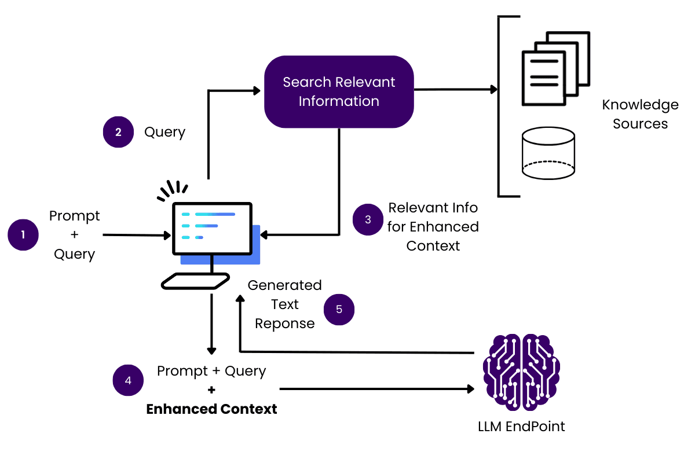

# 🧠 RAG and Reasoning Frameworks Tutorial

---
## 🔷 What is RAG (Retrieval-Augmented Generation)?

<details - open>
<summary>Definition and Purpose of RAG</summary>

---

- **RAG** is a technique that enhances the performance of Large Language Models (LLMs) by retrieving relevant information from external sources and incorporating it into the model's input at inference time.
- This helps the model produce **more accurate, up-to-date, and context-aware** responses.


### ⚙️ Core Components


- **Retrieval**
  - Search for relevant data or documents using semantic similarity.
- **Augmentation**
  - Inject retrieved content into the prompt with clear structure and instructions for the LLM.
  - You can also include re-ranking, filtering, or summarization steps if needed.
- **Generation**
  - The augmented prompt is passed to an LLM to generate the final response.

---
</details>

---

## 🔄 RAG Workflow Explained

<details - open>
<summary>Complete RAG Workflow from Input to Output</summary>

---
### 🖼️ System Architecture

- The diagram below illustrates the interaction between user input, retriever, context injection, and LLM output:
- 


### 🧭 RAG Step-by-Step Flow
- **Step 1: 📥 Receive a User Query**
  - The system gets a user input (question or prompt).
  - For example:
    - _"What are the latest advancements in robotics?"_
- **Step 2: 🔍 Search for Relevant Information**
  - The retriever looks for relevant content from external data sources — such as vector databases, knowledge graph, or APIs.
- **Step 3: 📚 Retrieve the Best Matching Content**
  - Extract the most relevant chunks or passages based on the query.
- **Step 4: 🧩 Augment the Prompt with Context**
  - Build a new prompt combining:
    - Instructions
    - Retrieved context
    - User question
- **Step 5: 🧠 Generate a Response with the LLM**
  - The LLM uses the combined prompt to generate a response that’s more informed and reliable.
- **Step 6: ✅ Return the Answer to the User**
  - The final output is accurate, context-rich, and ideally better than the LLM’s default behavior without retrieval.

---

</details>

---
## 🧪 Simple RAG Implementation in Python

<details - open>
<summary>Step-by-step Python Code for RAG</summary>

---

- **Install the required libraries**:
  ```bash
  pip install chromadb sentence-transformers langchain-openai
  ```
- **Python Code**:
  ```python
  import os
  from dotenv import load_dotenv
  from sentence_transformers import SentenceTransformer
  import chromadb
  from chromadb.config import Settings
  from langchain_openai import OpenAI

  # Load API key từ biến môi trường
  load_dotenv()
  os.environ["OPENAI_API_KEY"] = os.getenv("OPENAI_API_KEY")

  # 1. Load embedding model
  embedding_model = SentenceTransformer("all-MiniLM-L6-v2")

  # 2. Initialize Chroma in-memory DB
  chroma_client = chromadb.Client(Settings(anonymized_telemetry=False))
  collection = chroma_client.create_collection(name="rag_demo")

  # 3. Sample documents
  documents = [
      "This is the first document chunk.",
      "This is the second document chunk.",
      "More information in the third chunk."
  ]
  doc_ids = [f"doc_{i}" for i in range(len(documents))]

  # 4. Generate and insert embeddings
  embeddings = embedding_model.encode(documents).tolist()
  collection.add(documents=documents, ids=doc_ids, embeddings=embeddings)

  # 5. Retrieval function
  def retrieve(query, k=2):
      query_embedding = embedding_model.encode([query])[0].tolist()
      results = collection.query(query_embeddings=[query_embedding], n_results=k)
      return results['documents'][0]

  # 6. Prompt augmentation
  def create_prompt(query, contexts):
      context_text = "\n".join(contexts)
      return f"""You are a helpful assistant. Use the following context to answer the question.
  If you don't know the answer, say you don't know.

  Context:
  {context_text}

  Question:
  {query}

  Answer:"""

  # 7. Generate answer from OpenAI
  def generate_answer(prompt):
      llm = OpenAI()
      response = llm.invoke(prompt)
      return response.content # Corrected based on likely intent; original had response.content not response

  # 8. Full RAG pipeline
  def rag_pipeline(query):
      contexts = retrieve(query)
      prompt = create_prompt(query, contexts)
      return generate_answer(prompt)

  # 9. Example usage
  if __name__ == "__main__":
      user_query = "Tell me about the second document."
      answer = rag_pipeline(user_query)
      print("Answer:", answer)
  ```

---

</details>

---
## 💾 Vector Databases
<details open>
<summary>Introduction to Vector DBs</summary>

---
### 💡 Introduction to Vector DBs
- Vector databases are essential for enabling efficient and intelligent document retrieval in RAG systems.
- Unlike traditional databases that rely on exact keyword matches, vector DBs use dense numerical representations (embeddings) of documents and queries, allowing for semantic search.
- This means that even if a user's query doesn't contain the exact same words as the document, the system can still identify relevant content based on meaning and context.
- This dramatically improves the quality of retrieved data.
- Key capabilities include:
  - High-dimensional storage: Supports millions of embedding vectors.
  - Fast similarity search: Efficiently finds the top-k most similar vectors.
  - Scalability: Designed for high-volume, low-latency retrievals.
  - Metadata filtering: Combine vector similarity with structured filters (e.g., by document type or date).


### 📊 Comparative Analysis of Vector Databases
<details open>
<summary>Comparative analysis of Pinecone, Weaviate, and Chroma</summary>

---

#### Overall Comparison
- Overall comparison table:
  | Criteria                 | Pinecone                                | Weaviate                              | Chroma                                |
  |--------------------------|-----------------------------------------|-------------------------------------|--------------------------------------|
  | **Deployment Model**     | Fully managed cloud service             | Self-hosted or cloud, supports Docker/K8s | Self-hosted, embedded, native Python |
  | **Query Performance (p95)**| Very low (`10-100 ms`)                  | Low (`50-200 ms`)                     | Varies (`100-500 ms`)                |
  | **Scalability**          | Billions of vectors, auto-scaling       | Hundreds of millions of vectors, well-distributed | Tens of millions of vectors          |
  | **Enterprise Features**  | Comprehensive: HA, DR, access control, monitoring, encryption, SLA | Good: HA, DR (cloud), access control, monitoring, encryption | Basic: Limited HA, manual DR, simple access control |
  | **API & SDK Integration**| Simple REST API, integrates with popular embedding models | GraphQL, REST, supports multiple vectorizers, hybrid search | Simple API, Python-native, supports multiple embedding providers |
  | **Cost**                 | High                                    | Free open-source (self-hosted), pay-as-you-go cloud | Free, development cost to scale      |
  | **Operational Complexity**| Low, no infrastructure management needed| Medium to high, requires expertise for optimization | Low, easy setup, suitable for dev, prototyping |
  | **Suitable for**         | Large enterprises, needing SLAs, high security, production scale | Enterprises needing flexibility, hybrid search, multi-modal, open-source | Startups, individual developers, rapid prototyping, limited budget |

---

#### Detailed Pros and Cons

**Pinecone**
- **Advantages**
  - High performance, very low query latency, handles billions of vectors and large concurrent queries.
  - Fully managed cloud service, minimizing operational overhead.
  - Meets enterprise security standards (SOC 2 Type 2), offers SLAs, private cloud, and multi-region replication.
  - Simple REST API, easy integration with popular embedding models.
- **Disadvantages**
  - High operational cost, not suitable for small projects or individuals.
  - Less infrastructure customization, dependent on the service provider.
  - No self-hosted version, limited control over the entire stack.


**Weaviate**
- **Advantages**
  - Open-source, flexible deployment (self-hosted or cloud), supports Docker/Kubernetes.
  - Supports vector search combined with structured queries (GraphQL, BM25), multi-modal (text, image, audio).
  - Modular architecture, integrates multiple vectorizers, dynamic data updates.
  - Good enterprise features: HA, DR (cloud), access control, monitoring, data encryption.
- **Disadvantages**
  - Configuration and operation can be complex, requiring high expertise.
  - Self-hosting incurs infrastructure overhead, needs a strong technical team.
  - Some advanced features are only available in the paid cloud version.

**Chroma**
- **Advantages**
  - Simple API, easy setup, native Python, developer-friendly.
  - Supports in-memory and file-based storage, lightweight, easy integration with multiple embedding providers.
  - Free, suitable for startups, individual developers, limited budgets.
  - Fast indexing speed for small to medium-sized data.
- **Disadvantages**
  - Lacks enterprise features like advanced monitoring, security, HA.
  - Higher query latency, limited capability for handling concurrent queries.
  - Less scalability and capacity for handling large datasets.
  - Manual disaster recovery, limited security and monitoring.

---

#### Recommendations Based on Production Needs
- Recommendations based on production needs:
  | Deployment Need                                     | Suitable Platform                               | Key Reason                                      |
  |-----------------------------------------------------|-------------------------------------------------|-------------------------------------------------|
  | Large enterprise, needs SLA, security, production scale | **Pinecone**                                     | High performance, managed service, good security |
  | Flexible, multi-purpose, hybrid search, open-source   | **Weaviate**                                     | Multi-modal support, self-host or cloud option  |
  | Startup, individual dev, prototyping, low budget      | **Chroma**                                       | Developer-friendly, easy deployment, low cost   |

---

#### Considerations for Production Deployment
- Design the embedding model and data schema appropriately from the start.
- Monitor queries, recall rate, and resources to ensure performance.
- Plan for scaling in accordance with data volume and query load.
- Security: authentication, authorization, data encryption.
- Effective data backup and recovery, especially with self-hosted or cloud platforms offering DR.

---

#### Conclusion
- Choosing the right vector database platform is a critical factor for the success and scalability of an enterprise RAG system.
- **Pinecone** is a top choice for large enterprises needing high stability and security with a comprehensive managed service.
- **Weaviate** is suitable for organizations requiring a flexible, multi-purpose solution, with options for self-hosting or cloud, prioritizing open-source.
- **Chroma** is an ideal choice for startups, individual developers, or small projects needing rapid development, low cost, and Python-friendliness.

---

</details>
