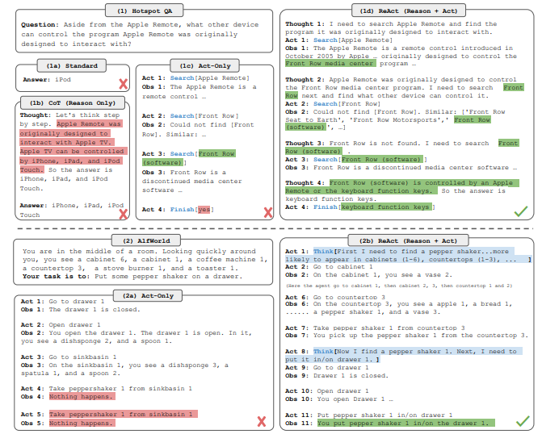
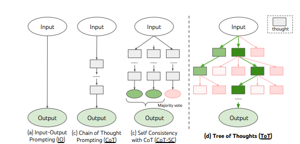

# 🧠 RAG and Reasoning Frameworks: A Comprehensive Tutorial

---
## Executive Summary & Core Concepts
---

### High-Level Overview for Stakeholders
<details - open>
<summary>Understand RAG and Reasoning in 60 Seconds</summary>

---

- **What is RAG (Retrieval-Augmented Generation)?**
  - Think of RAG as giving a Large Language Model (LLM) an **open-book exam**.
  - Instead of relying solely on its pre-existing knowledge (which can be outdated or generic), the LLM first *retrieves* relevant, up-to-date information from a specific knowledge base (like your company's documents).
  - It then uses this retrieved information as context to *generate* a more accurate, reliable, and context-aware answer.

- **Why are Reasoning Frameworks needed?**
  - If RAG gives the LLM the right textbook page, a **Reasoning Framework** teaches it *how to think* about the information on that page.
  - These frameworks (like ReAct or Chain-of-Thought) provide a structured process for the LLM to break down complex problems, use tools, and form logical conclusions, rather than just summarizing the retrieved text.

- **The Synergy**:
  - **RAG** provides the *what* (the relevant data).
  - **Reasoning Frameworks** provide the *how* (the logical process).
  - Combining them creates powerful AI systems that are not only knowledgeable but also intelligent, capable of solving complex, multi-step problems with high accuracy and transparency.

---
</details>

### Terminology
<details - open>
<summary>Glossary of Essential Terms</summary>

---

- **RAG (Retrieval-Augmented Generation)**: A technique that enhances LLM responses by retrieving relevant data from an external knowledge base and providing it as context in the prompt.
- **Vector Database**: A specialized database designed to store and efficiently search for high-dimensional vectors, which are numerical representations (embeddings) of text, images, or other data. Essential for semantic search in RAG.
- **Embedding**: A dense vector of floating-point numbers that represents the semantic meaning of a piece of data. Similar concepts will have similar embedding vectors.
- **Chunking**: The process of breaking down large documents into smaller, semantically coherent pieces of text ("chunks") before they are embedded and stored.
- **Reasoning Framework**: A structured methodology (e.g., Chain-of-Thought, ReAct) that guides an LLM to perform complex, multi-step problem-solving.
- **Chain-of-Thought (CoT)**: A prompting technique that encourages an LLM to explain its reasoning process step-by-step, improving accuracy on complex tasks.
- **ReAct (Reasoning and Acting)**: A framework where an LLM iteratively cycles through `Thought -> Action -> Observation` to use tools and solve problems.
- **LangChain / LlamaIndex**: Popular open-source frameworks for building applications powered by LLMs, with strong support for RAG and agentic workflows.

---
</details>

### The Standard RAG Workflow
<details - open>
<summary>Visualizing the Complete RAG Pipeline</summary>

---

- **Core Idea**: The RAG process transforms a user's question into a rich, context-aware prompt for the LLM.

#### System Architecture
- The diagram below illustrates the two main phases: **1. Data Indexing (Offline)** and **2. Retrieval & Generation (Online)**.
  ```mermaid
  graph TD
      subgraph "Phase 1: Data Indexing (Offline Process)"
          A[📄 Source Documents] --> B(🔪 Chunking);
          B --> C(🧠 Embedding Model);
          C --> D[💾 Vector Database];
      end

      subgraph "Phase 2: Retrieval & Generation (Online Process)"
          E[🧑‍💻 User Query] --> F(🧠 Embedding Model);
          F --> G{🔍 Similarity Search};
          D -- Retrieved Chunks --> G;
          G --> H[📝 Prompt Augmentation];
          E --> H;
          H --> I[💡 LLM];
          I --> J[✅ Final Answer];
      end

      style D fill:#D6EAF8,stroke:#3498DB
      style I fill:#E8DAEF,stroke:#8E44AD
  ```

#### Step-by-Step Process
- **Step 1: 📥 Receive User Query**: The system captures the user's input (e.g., *"What are the latest advancements in robotics?"*).
- **Step 2: 🔍 Embed the Query**: The same embedding model used for indexing converts the user's query into a vector.
- **Step 3: 📚 Retrieve Relevant Chunks**: The system performs a similarity search in the vector database to find the document chunks whose embeddings are closest to the query's embedding.
- **Step 4: 🧩 Augment the Prompt**: A new, comprehensive prompt is constructed, combining the original user query with the retrieved context chunks.
- **Step 5: 🧠 Generate Response**: This augmented prompt is sent to the LLM, which uses the provided context to formulate an informed and accurate answer.
- **Step 6: ✅ Return Answer**: The final, context-rich response is delivered to the user.

---
</details>

---
## The Data Foundation: Ingestion and Storage
---

### Step 1: Document Loading & Chunking Strategies
<details - open>
<summary>Breaking Down Documents for Effective Retrieval</summary>

---

- **The Goal**: Before data can be retrieved, it must be loaded and broken down into manageable, semantically meaningful pieces (chunks). The quality of chunking directly impacts the quality of retrieval.

#### Fixed-Size Chunking
- **Mechanism**: The simplest method, splitting text into chunks of a fixed number of characters or tokens, often with some overlap to preserve context.
- **Pros**: Simple and fast.
- **Cons**: High risk of cutting sentences or ideas in half, destroying semantic meaning.
- **Best For**: Prototyping or when document structure is irrelevant.
- **Implementation (LangChain)**:
  ```python
  from langchain_text_splitters import CharacterTextSplitter
  text_splitter = CharacterTextSplitter(chunk_size=256, chunk_overlap=30)
  chunks = text_splitter.split_text("Your long text document...")
  ```

---

#### Recursive Chunking
- **Mechanism**: A smarter method that tries to split text based on a prioritized list of separators (e.g., `\n\n`, `\n`, `. `, ` `). It recursively splits until chunks are under the desired size.
- **Pros**: Good balance of size control and semantic preservation. Often the recommended default.
- **Cons**: Relies on the structure of the separator list.
- **Best For**: Most unstructured or semi-structured text like articles and reports.
- **Implementation (LangChain)**:
  ```python
  from langchain_text_splitters import RecursiveCharacterTextSplitter
  text_splitter = RecursiveCharacterTextSplitter(chunk_size=500, chunk_overlap=50)
  chunks = text_splitter.split_text("Your complex document...")
  ```

---

#### Content-Aware / Semantic Chunking
- **Mechanism**: Uses NLP models to split text at points of semantic change. It groups sentences with similar meanings together.
- **Pros**: Creates highly coherent chunks, leading to better retrieval quality.
- **Cons**: Computationally expensive and slower due to embedding calculations.
- **Best For**: Complex documents where thematic relevance is critical for high-accuracy Q&A.
- **Implementation (LangChain Experimental)**:
  ```python
  from langchain_experimental.text_splitter import SemanticChunker
  from langchain_openai import OpenAIEmbeddings
  semantic_splitter = SemanticChunker(OpenAIEmbeddings())
  # Returns Document objects
  chunk_docs = semantic_splitter.create_documents(["Your text with multiple topics..."])
  ```

---

#### Guidance on Choosing a Strategy
- **Start with `RecursiveCharacterTextSplitter`**: It's a robust and flexible default for most use cases.
- **Use `MarkdownHeaderTextSplitter` for structured docs**: If your source is Markdown, leverage its structure.
- **Experiment and Evaluate**: The best strategy depends on your data and application. Test different methods and evaluate retrieval quality.
- **Preserve Metadata**: Always associate chunks with their source metadata (e.g., document name, page number). This is crucial for source verification later.

---
</details>

### Step 2: Embedding & Vector Databases
<details - open>
<summary>Storing and Searching for Information by Meaning</summary>

---

- **The Goal**: Once documents are chunked, they must be converted into numerical representations (embeddings) and stored in a specialized database for efficient semantic search.

#### What are Vector Databases?
- **Purpose**: Vector databases are built to store and query millions or billions of high-dimensional vectors.
- **Function**: Instead of matching keywords, they find items based on semantic similarity (i.e., "conceptual closeness"). This is the engine that powers RAG's retrieval step.
- **Key Capabilities**:
  - **Fast Similarity Search**: Uses algorithms like HNSW (Hierarchical Navigable Small World) to find the "nearest neighbors" to a query vector with very low latency.
  - **Scalability**: Designed to handle massive datasets and high query loads.
  - **Metadata Filtering**: Allows combining semantic search with traditional structured filters (e.g., "find documents similar to X, but only from after date Y").

---

#### Comparative Analysis of Popular Vector DBs
- **Choosing the right Vector DB is a critical production decision.**
  | Criteria | Pinecone | Weaviate | Chroma |
  | :--- | :--- | :--- | :--- |
  | **Deployment Model** | Fully managed cloud service | Self-hosted (Docker/K8s) or managed cloud | Self-hosted, embedded in Python |
  | **Best For** | **Large enterprises** needing high performance, SLAs, and zero operational overhead. | **Flexible enterprises** wanting open-source, hybrid search, and multi-modal capabilities. | **Startups & developers** for rapid prototyping, local development, and low-cost projects. |
  | **Key Strength** | Extreme performance and scalability, ease of use. | Flexibility, hybrid search (semantic + keyword), open-source. | Simplicity, developer-friendliness, free. |
  | **Operational Cost** | High (pay-as-you-go service) | Medium (cloud) to High (self-hosted infra/ops cost) | Low (free, but scaling requires engineering effort) |

---

#### Recommendations Based on Production Needs
- **For a large-scale, mission-critical enterprise application with a strict SLA**:
  - **Choose `Pinecone`**. The managed service model offloads all operational complexity and guarantees performance.
- **For an organization that values open-source, needs hybrid search, or wants to self-host for data sovereignty**:
  - **Choose `Weaviate`**. It offers the most flexibility and powerful features for complex, custom deployments.
- **For a startup, a research project, or initial application development**:
  - **Choose `Chroma`**. Its simplicity and ease of setup make it ideal for getting started quickly without incurring costs.

---
</details>

---
## The Generation & Reasoning Layer
---

### Basic RAG: The Generation Step
<details - open>
<summary>A Simple End-to-End RAG Implementation</summary>

---

- **The Goal**: This example ties together the concepts of chunking, embedding, storage, and retrieval to generate a final answer.

#### Simple RAG Implementation in Python
- This code demonstrates a minimal, in-memory RAG pipeline using `Chroma` and `LangChain`.
  ```python
  # Required libraries: pip install chromadb sentence-transformers langchain-openai python-dotenv
  import os
  from dotenv import load_dotenv
  from sentence_transformers import SentenceTransformer
  import chromadb
  from langchain_openai import OpenAI

  # Load API key from .env file
  load_dotenv()
  # Ensure OPENAI_API_KEY is set in your environment

  # 1. Setup Embedding Model and Vector DB
  embedding_model = SentenceTransformer("all-MiniLM-L6-v2")
  chroma_client = chromadb.Client() # In-memory
  collection = chroma_client.create_collection(name="rag_demo")

  # 2. Sample Documents & Indexing
  documents = [
      "The first document discusses the history of AI.",
      "The second document explains the architecture of Transformers.",
      "The third document details the applications of machine learning."
  ]
  doc_ids = [f"doc_{i}" for i in range(len(documents))]
  embeddings = embedding_model.encode(documents).tolist()
  collection.add(documents=documents, ids=doc_ids, embeddings=embeddings)

  # 3. Retrieval Function
  def retrieve(query, k=1):
      query_embedding = embedding_model.encode([query]).tolist()
      results = collection.query(query_embeddings=query_embedding, n_results=k)
      return results['documents'][0]

  # 4. Prompt Augmentation
  def create_augmented_prompt(query, context):
      return f"""Use the following context to answer the question.
  If you don't know the answer from the context, say so.

  Context:
  {context}

  Question: {query}
  """

  # 5. Generation
  def generate_answer(prompt):
      llm = OpenAI()
      response = llm.invoke(prompt)
      return response

  # 6. Full RAG Pipeline
  def rag_pipeline(query):
      retrieved_context = retrieve(query)
      augmented_prompt = create_augmented_prompt(query, retrieved_context)
      answer = generate_answer(augmented_prompt)
      print(f"Retrieved Context: {retrieved_context}")
      print(f"Final Answer: {answer}")

  # Example Usage
  rag_pipeline("What is the second document about?")
  ```

---
</details>

### Advanced RAG: Introducing Reasoning Frameworks
<details - open>
<summary>Moving Beyond Simple Q&A to Complex Problem-Solving</summary>

---

- **The Limitation of Basic RAG**: Basic RAG is excellent for answering direct questions where the answer exists in a single retrieved chunk. It struggles with questions that require:
  - Combining information from multiple sources.
  - Multi-step logical deduction.
  - Using tools to find additional information.

- **The Role of Reasoning Frameworks**:
  - They provide a structured "thinking process" for the LLM.
  - They enable the LLM to decompose complex problems, create a plan, interact with tools (including the RAG retriever), and synthesize information to arrive at a solution.
  - They bridge the gap between simple information retrieval and true artificial intelligence.

- **Relationship between RAG and Reasoning**:
  - In an advanced system, **RAG is a tool** that a reasoning framework can use.
  - The reasoning framework acts as the "agent" or "orchestrator," deciding *when* and *what* to retrieve using the RAG system as part of a larger problem-solving plan.

---
</details>

### Deep Dive: Popular Reasoning Frameworks
<details - open>
<summary>Exploring CoT, ReAct, ToT, and Planning Frameworks</summary>

---

#### Chain-of-Thought (CoT)
- **Concept**: A simple but powerful prompting technique that instructs the LLM to "think step by step."
- **How it Works**: By showing its work, the LLM is more likely to follow a logical path and arrive at the correct answer.
- **Example Prompt**:
  ```
  Q: A farmer had 15 sheep and all but 8 died. How many are left?
  A: Let's think step by step. The phrase "all but 8 died" means that 8 sheep survived. So, the farmer has 8 sheep left.
  ```
- **Use Case**: Improves performance on arithmetic, commonsense, and symbolic reasoning tasks.

---

#### ReAct (Reasoning and Acting)
- **Concept**: A framework that enables an LLM to use tools in a loop of `Thought -> Action -> Observation`.
- **How it Works**:
  1.  **Thought**: The LLM analyzes the goal and decides what to do next (e.g., "I need to search for the current weather").
  2.  **Action**: The LLM selects a tool (e.g., `WeatherAPI`) and provides the input (e.g., `{"location": "San Francisco"}`).
  3.  **Observation**: The system executes the tool and returns the result (e.g., "15°C, foggy") to the LLM. The loop repeats.
- **Use Case**: Building autonomous agents that can interact with external systems (APIs, databases, RAG retrievers) to solve problems.
- **Illustration**:
  

---

#### Tree-of-Thought (ToT)
- **Concept**: An advanced framework where the LLM explores multiple reasoning paths simultaneously, like a tree.
- **How it Works**: It generates several different "thoughts" or next steps, evaluates their promise, and pursues the most likely paths, pruning the bad ones.
- **Use Case**: Solving complex problems that require exploration and backtracking, where a single line of reasoning might fail. It is computationally very expensive.
- **Illustration**:
  

---

#### Planning Frameworks
- **Concept**: The LLM first creates a multi-step plan to solve a problem and then executes that plan.
- **How it Works**:
  1.  **Plan Generation**: The LLM generates a sequence of actions (e.g., "Step 1: Retrieve user's purchase history. Step 2: Analyze for patterns. Step 3: Generate recommendations.").
  2.  **Plan Execution**: An orchestrator (which can be another agent) executes each step, often using tools like ReAct agents for individual steps.
- **Use Case**: Complex, long-running tasks that require a high-level strategy before execution.

---
</details>

---
## Frameworks & Implementation
---

### Choosing Your Toolkit: LangChain vs. LlamaIndex
<details - open>
<summary>A Comparative Analysis of the Two Leading RAG Frameworks</summary>

---

- **Core Philosophy**:
  - **LangChain**: A **general-purpose, developer-first framework** for building any kind of LLM application. It's like a versatile Swiss Army knife. Its strength is in creating complex chains and autonomous agents.
  - **LlamaIndex**: A **specialized data framework** purpose-built for optimizing RAG pipelines. Its strength is in data ingestion, indexing, and advanced retrieval strategies.

- **High-Level Comparison**:
  | Feature | LangChain | LlamaIndex |
  | :--- | :--- | :--- |
  | **Primary Focus** | **Agentic Workflows** & general LLM application development. | **Data-centric RAG** & connecting LLMs to data. |
  | **Strengths** | Maximum flexibility, vast tool integrations, powerful agent orchestration (`LangGraph`). | Streamlined RAG pipelines, advanced indexing, high-performance retrieval. |
  | **Best For** | Building complex, multi-tool agents where RAG is one component. | Building high-performance Q&A systems where RAG is the core functionality. |

- **When to Choose Which?**
  - **Choose LangChain when**: Your project requires building a complex agent that uses many different tools (APIs, databases, calculators) and has intricate logic. RAG is just one of the tools in its toolbox.
  - **Choose LlamaIndex when**: Your project's primary goal is to build a highly optimized Q&A or summarization system over your own data. You need the best possible retrieval performance.

---
</details>

### Architectural Pattern: Combining Frameworks
<details - open>
<summary>Leveraging the Best of Both Worlds for Production Systems</summary>

---

- **The Hybrid Approach**: The most powerful architecture often involves using both frameworks together.
  - **LlamaIndex** acts as the highly optimized **"data plane"**. It handles all the complex data ingestion, indexing, and retrieval.
  - **LangChain** acts as the flexible **"control plane"**. It orchestrates the agent's logic, deciding when to call the LlamaIndex-powered retriever as a tool.

- **Implementation Example**:
  - This code shows how to wrap a LlamaIndex query engine as a `Tool` that a LangChain agent can use.
  ```python
  # Required: pip install llama-index langchain langchain-openai openai python-dotenv
  import os
  from dotenv import load_dotenv
  from llama_index.core import VectorStoreIndex, SimpleDirectoryReader, Settings
  from llama_index.llms.openai import OpenAI as LlamaOpenAI
  from langchain.agents import initialize_agent, AgentType
  from langchain_core.tools import Tool
  from langchain_openai import OpenAI as LangchainOpenAI

  load_dotenv() # Loads OPENAI_API_KEY

  # --- 1. LlamaIndex: Setup a high-performance retriever ---
  Settings.llm = LlamaOpenAI(model="gpt-3.5-turbo")
  # Create a dummy data file
  os.makedirs("data", exist_ok=True)
  with open("data/company_info.txt", "w") as f:
      f.write("FutureTech was founded in 2020. Its flagship product, AlphaBot, costs $10,000.")
  documents = SimpleDirectoryReader("data").load_data()
  index = VectorStoreIndex.from_documents(documents)
  query_engine = index.as_query_engine()

  # --- 2. LangChain: Wrap the LlamaIndex engine in a Tool ---
  llama_retriever_tool = Tool(
      name="FutureTechKnowledgeBase",
      func=lambda q: str(query_engine.query(q)),
      description="Use this to answer questions about FutureTech and its products."
  )

  # --- 3. LangChain: Create an agent that can use the tool ---
  tools = [llama_retriever_tool]
  langchain_llm = LangchainOpenAI(temperature=0)
  agent = initialize_agent(
      tools, langchain_llm, agent=AgentType.ZERO_SHOT_REACT_DESCRIPTION, verbose=True
  )

  # --- 4. Run the agent ---
  agent.run("What is the price of AlphaBot?")
  ```

---
</details>

---
## Production-Grade RAG: Advanced Techniques
---

### Multi-hop Reasoning
<details - open>
<summary>Answering Complex Questions by Connecting Multiple Pieces of Information</summary>

---

- **Definition**: The ability to answer a question that requires synthesizing information from multiple documents or steps.
- **Example Question**: *"Which university did the founder of the company that acquired DeepMind attend?"*
- **Required Steps**:
  1.  Who acquired DeepMind? -> **Google**
  2.  Who founded Google? -> **Larry Page & Sergey Brin**
  3.  Where did they attend university? -> **Stanford University**
- **Implementation**: This is typically achieved using reasoning frameworks like **ReAct** or **Planning Agents** that can perform a series of retrievals and synthesize the results.

---
</details>

### Fact-Checking & Groundedness
<details - open>
<summary>Ensuring the LLM's Answer is Faithfully Supported by the Retrieved Context</summary>

---

- **The Problem**: LLMs can "hallucinate" or make statements not supported by the provided context. This is unacceptable in enterprise applications.
- **The Goal**: Verify that the generated answer is "grounded" in the retrieved documents.
- **Implementation Strategies**:
  - **Groundedness Prompting**: Instruct the LLM in its main prompt to *only* use the provided context and to cite its sources.
  - **Verifier Chain**: Use a second, separate LLM call to act as a "fact-checker." This verifier is given the original context and the generated answer and is asked to confirm if the answer is supported.
- **Sample Verifier Prompt**:
  ```
  Context: {retrieved_chunks}
  Answer: {llm_generated_answer}

  Based *only* on the context provided, is the answer factually correct? Respond with "Yes" or "No" and a brief explanation.
  ```

---
</details>

### Source Verification & Citations
<details - open>
<summary>Providing Transparency by Citing Sources</summary>

---

- **The Need**: Users, especially in enterprise settings, need to trust the AI's output. Providing sources allows for transparency and human verification.
- **How it Works**:
  1.  **Store Metadata**: When chunking, each chunk must be stored with its source metadata (e.g., `document_name`, `page_number`, `url`).
  2.  **Retrieve with Metadata**: The retrieval process must return both the content of the chunks and their associated metadata.
  3.  **Synthesize with Citations**: The final prompt should instruct the LLM to generate an answer and include citations in the text, referencing the sources from the metadata.
- **Example Output**:
  > "The AlphaBot product costs $10,000 [Source: company_info.txt]. It was developed by FutureTech, which was founded in 2020 [Source: company_info.txt]."

---
</details>

---