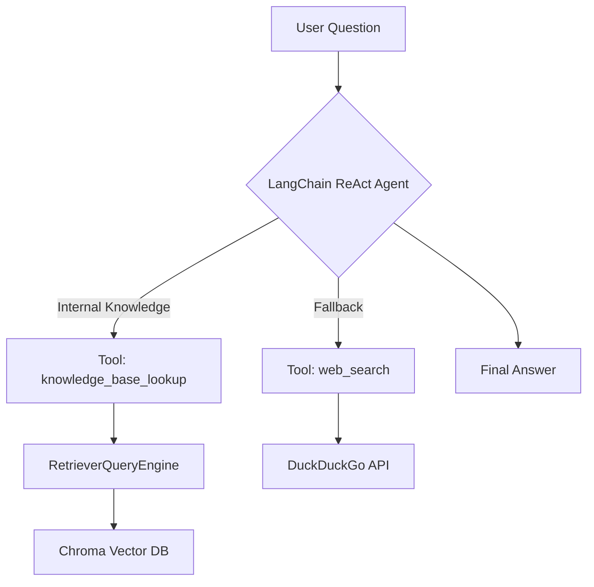

### 🛠 Implementation Guide: End-to-End RAG Pipeline with Multi-hop ReAct Agent

---

### 🔰 Overview
This guide demonstrates an end-to-end RAG pipeline:
- **LlamaIndex** for ingestion & retrieval
- **Chroma** as vector DB
- **LangChain ReAct Agent** for reasoning
- **DuckDuckGo Tool** as external search fallback
---

### 🧭 System Architecture Diagram


---

### 🧱 Tech Stack Overview

| Layer                    | Tool / Framework                     | Purpose                                                    |
|--------------------------|--------------------------------------|------------------------------------------------------------|
| Document Ingestion       | `SimpleDirectoryReader` (LlamaIndex) | Load raw files from local directory                        |
| Chunking & Embedding     | `SentenceSplitter`, `HuggingFaceEmbedding` | Convert docs to semantic chunks and vectors       |
| Vector Storage           | `ChromaVectorStore` + Chroma DB      | Store and query dense embeddings                           |
| Semantic Search          | `VectorIndexRetriever`               | Retrieve relevant chunks based on vector similarity        |
| Tool Abstraction         | LangChain `Tool`                     | Wrap retriever and search as callable tools                |
| External Knowledge Tool  | `DuckDuckGoSearchRun`                | Perform fallback searches for general queries              |
| Reasoning Engine         | `ReAct Agent` (LangChain)            | Enable step-by-step tool selection and execution           |
| Language Model           | `OpenAI`                             | Used for generation and reasoning                          |

---

### 🧩 Step-by-step Breakdown with Code

#### 🟡 Step 1: Load and Embed Documents
```python
from llama_index.core import SimpleDirectoryReader, VectorStoreIndex, ServiceContext
from llama_index.core.node_parser import SentenceSplitter
from llama_index.core.embeddings import HuggingFaceEmbedding
from llama_index.vector_stores.chroma import ChromaVectorStore
import chromadb

def load_and_index_docs(folder_path):
    documents = SimpleDirectoryReader(folder_path).load_data()
    node_parser = SentenceSplitter(chunk_size=512, chunk_overlap=50)
    embed_model = HuggingFaceEmbedding(model_name="sentence-transformers/all-MiniLM-L6-v2")
    service_context = ServiceContext.from_defaults(embed_model=embed_model, node_parser=node_parser)
    chroma_client = chromadb.Client()
    vector_store = ChromaVectorStore(chroma_collection=chroma_client.create_collection("rag_docs"))
    index = VectorStoreIndex.from_documents(documents, service_context=service_context, vector_store=vector_store)
    return index
```

#### 🟡 Step 2: Create Query Engine & Retriever
```python
from llama_index.core.query_engine import RetrieverQueryEngine
from llama_index.core.retrievers import VectorIndexRetriever

def setup_query_engine(index):
    retriever = VectorIndexRetriever(index=index, similarity_top_k=5)
    query_engine = RetrieverQueryEngine(retriever=retriever)
    return query_engine, retriever
```

#### 🟡 Step 3: Wrap Retriever into LangChain Tool
```python
from langchain.agents import Tool

def build_qa_tool(query_engine):
    def query_fn(q):
        return query_engine.query(q).response

    return Tool(
        name="knowledge_base_lookup",
        func=query_fn,
        description="Use this tool to query internal knowledge base."
    )
```

#### 🟡 Step 4: Add Web Search Tool (DuckDuckGo)
```python
from langchain.tools import DuckDuckGoSearchRun

def build_search_tool():
    search = DuckDuckGoSearchRun()
    return Tool(
        name="web_search",
        func=search.run,
        description="Use this tool to search external general knowledge."
    )
```

#### 🟡 Step 5: Setup ReAct Agent (Multi-hop Execution Enabled)
```python
from langchain.agents import initialize_agent, AgentType
from langchain.llms import OpenAI

def build_react_agent(tools):
    return initialize_agent(
        tools=tools,
        agent=AgentType.ZERO_SHOT_REACT_DESCRIPTION,
        llm=OpenAI(temperature=0),
        verbose=True  # Show reasoning steps
    )
```

#### 🟡 Step 6: Ask a Complex, Multi-hop Question
```python
def multi_hop_reasoning(agent, question):
    print("\n🤔 Reasoning Trace:")
    return agent.run(question)
```

#### 🧪 Step 7: Main Pipeline Runner
```python
if __name__ == "__main__":
    index = load_and_index_docs("./data")
    query_engine, retriever = setup_query_engine(index)
    qa_tool = build_qa_tool(query_engine)
    search_tool = build_search_tool()
    agent = build_react_agent([qa_tool, search_tool])

    question = (
        "What are the key differences between Pinecone and Weaviate in terms of scalability and "
        "search algorithm, and how should I choose between them for a multi-tenant architecture?"
    )

    final_answer = multi_hop_reasoning(agent, question)
    print("\n🧠 Final Answer:\n", final_answer)
```

---

### ✅ Notes on Multi-hop Reasoning
- The ReAct agent interprets the complex query and performs **step-by-step tool calls**.
- Intermediate reasoning ("Thought:", "Action:") is visible thanks to `verbose=True`.
- Example output clearly shows **multi-hop trace**:
```
> Thought: I need to know the vector DBs used for multi-tenant search
> Action: knowledge_base_lookup
...
> Thought: Let's check Weaviate’s open-source scalability limits
> Action: web_search
...
```

