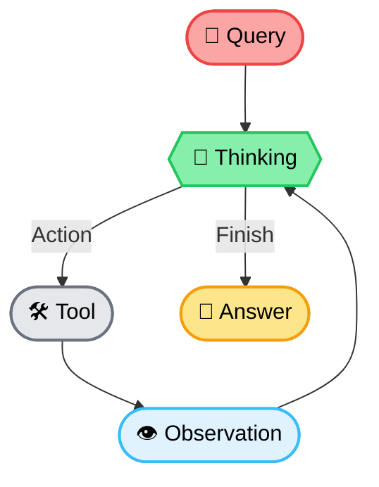

### 🛠 Implementation Guide: End-to-End RAG Pipeline with Multi-hop ReAct Agent

---

### 🔰 Overview
This guide demonstrates an end-to-end RAG pipeline:
- **LlamaIndex** for ingestion & retrieval
- **Chroma** as vector DB
- **LangChain ReAct Agent** for reasoning
- **DuckDuckGo Tool** as external search fallback
---

### 🧭 System Architecture Diagram


---

### 🧱 Tech Stack Overview

| Layer                    | Tool / Framework                     | Purpose                                                    |
|--------------------------|--------------------------------------|------------------------------------------------------------|
| Document Ingestion       | `SimpleDirectoryReader` (LlamaIndex) | Load raw files from local directory                        |
| Chunking & Embedding     | `SentenceSplitter`, `HuggingFaceEmbedding` | Convert docs to semantic chunks and vectors       |
| Vector Storage           | `ChromaVectorStore` + Chroma DB      | Store and query dense embeddings                           |
| Semantic Search          | `VectorIndexRetriever`               | Retrieve relevant chunks based on vector similarity        |
| Tool Abstraction         | LangChain `Tool`                     | Wrap retriever and search as callable tools                |
| External Knowledge Tool  | `DuckDuckGoSearchRun`                | Perform fallback searches for general queries              |
| Reasoning Engine         | `ReAct Agent` (LangChain)            | Enable step-by-step tool selection and execution           |
| Language Model           | `OpenAI`                             | Used for generation and reasoning                          |

---

### 🧩 Step-by-step Breakdown with Code

#### 🟡 Step 1: Load and Embed Documents
```python
from llama_index.core import SimpleDirectoryReader, VectorStoreIndex, ServiceContext
from llama_index.core.node_parser import SentenceSplitter
from llama_index.core.embeddings import HuggingFaceEmbedding
from llama_index.vector_stores.chroma import ChromaVectorStore
import chromadb

def load_and_index_docs(folder_path):
    documents = SimpleDirectoryReader(folder_path).load_data()
    node_parser = SentenceSplitter(chunk_size=512, chunk_overlap=50)
    embed_model = HuggingFaceEmbedding(model_name="sentence-transformers/all-MiniLM-L6-v2")
    service_context = ServiceContext.from_defaults(embed_model=embed_model, node_parser=node_parser)
    chroma_client = chromadb.Client()
    vector_store = ChromaVectorStore(chroma_collection=chroma_client.create_collection("rag_docs"))
    index = VectorStoreIndex.from_documents(documents, service_context=service_context, vector_store=vector_store)
    return index
```

#### 🟡 Step 2: Create Query Engine & Retriever
```python
from llama_index.core.query_engine import RetrieverQueryEngine
from llama_index.core.retrievers import VectorIndexRetriever

def setup_query_engine(index):
    retriever = VectorIndexRetriever(index=index, similarity_top_k=5)
    query_engine = RetrieverQueryEngine(retriever=retriever)
    return query_engine, retriever
```

#### 🟡 Step 3: Wrap Retriever into LangChain Tool
```python
from langchain.agents import Tool

def build_qa_tool(query_engine):
    def query_fn(q):
        return query_engine.query(q).response

    return Tool(
        name="knowledge_base_lookup",
        func=query_fn,
        description="Use this tool to query internal knowledge base."
    )
```

#### 🟡 Step 4: Add Web Search Tool (DuckDuckGo)
```python
from langchain.tools import DuckDuckGoSearchRun

def build_search_tool():
    search = DuckDuckGoSearchRun()
    return Tool(
        name="web_search",
        func=search.run,
        description="Use this tool to search external general knowledge."
    )
```

#### 🟡 Step 5: Setup ReAct Agent (Multi-hop Execution Enabled)
```python
from langchain.agents import initialize_agent, AgentType
from langchain.llms import OpenAI

def build_react_agent(tools):
    return initialize_agent(
        tools=tools,
        agent=AgentType.ZERO_SHOT_REACT_DESCRIPTION,
        llm=OpenAI(temperature=0),
        verbose=True  # Show reasoning steps
    )
```

#### 🟡 Step 6: Ask a Complex, Multi-hop Question
```python
def multi_hop_reasoning(agent, question):
    print("\n🤔 Reasoning Trace:")
    return agent.run(question)
```

#### 🧪 Step 7: Main Pipeline Runner
```python
if __name__ == "__main__":
    index = load_and_index_docs("./data")
    query_engine, retriever = setup_query_engine(index)
    qa_tool = build_qa_tool(query_engine)
    search_tool = build_search_tool()
    agent = build_react_agent([qa_tool, search_tool])

    question = (
        "What are the key differences between Pinecone and Weaviate in terms of scalability and "
        "search algorithm, and how should I choose between them for a multi-tenant architecture?"
    )

    final_answer = multi_hop_reasoning(agent, question)
    print("\n🧠 Final Answer:\n", final_answer)
```

---

### ✅ Notes on Multi-hop Reasoning
- The ReAct agent interprets the complex query and performs **step-by-step tool calls**.
- Intermediate reasoning ("Thought:", "Action:") is visible thanks to `verbose=True`.
- Example output clearly shows **multi-hop trace**:
```
> Thought: I need to know the vector DBs used for multi-tenant search
> Action: knowledge_base_lookup
...
> Thought: Let's check Weaviate’s open-source scalability limits
> Action: web_search
...
```
---
</details>

---

## 🔍 Evaluation and Optimization

Để đánh giá hiệu quả truy xuất trong hệ thống RAG, chúng tôi sử dụng tập dữ liệu multi-hop từ [MultiHop-RAG](https://openreview.net/pdf?id=t4eB3zYWBK), trong đó mỗi truy vấn yêu cầu nhiều đoạn context liên quan. Vì vậy, framework như **RAGAS** không phù hợp do giả định chỉ một đoạn context đúng.

### 🎯 Evaluation Metrics

Chúng tôi sử dụng 4 chỉ số phổ biến trong đánh giá hệ thống truy xuất thông tin:

---

### 📌 **Recall\@k**

> Đo tỷ lệ tài liệu liên quan trong tập top-k được truy xuất so với tổng số tài liệu ground-truth.

**Công thức:**

```math
Recall@k = \frac{|\text{Retrieved@k} \cap \text{GroundTruth}|}{|\text{GroundTruth}|}
```

---

### 📌 **Precision\@k**

> Đo tỷ lệ tài liệu liên quan trong top-k kết quả so với tổng số tài liệu được truy xuất.

```math
Precision@k = \frac{|\text{Retrieved@k} \cap \text{GroundTruth}|}{k}
```

---

### 📌 **MAP\@k** (Mean Average Precision)

> Trung bình các Precision tính tại từng vị trí có tài liệu liên quan.

```math
AP@k = \frac{1}{|\text{GT}|} \sum_{j=1}^{k} P(j) \cdot rel(j)
```

```math
MAP@k = \frac{1}{N} \sum_{i=1}^{N} AP@k_i
```

---

### 📌 **Hits\@k**

> Đo tỷ lệ truy vấn mà ít nhất một tài liệu liên quan nằm trong top-k.

```math
Hits@k_i =
\begin{cases}
1 & \text{if } \exists r \in \text{Retrieved@k}_i \cap \text{GT}_i \\
0 & \text{otherwise}
\end{cases}
```

```math
Hits@k = \frac{1}{N} \sum_{i=1}^{N} Hits@k_i
```

---

## 🔧 Setup

```python
from langchain_community.vectorstores import Chroma
from langchain.embeddings import HuggingFaceEmbeddings
from langchain.retrievers import BM25Retriever
from langchain.schema import Document

from datasets import Dataset
import concurrent.futures
from typing import List, Dict, Tuple

# Embedding model
embedding = HuggingFaceEmbeddings(
    model_name="BAAI/bge-large-en-v1.5",
    model_kwargs={"device": "cuda"}
)

# Build vector store
vectorstore = Chroma.from_texts(
    texts=texts,
    embedding=embedding,
    persist_directory="./chroma_store_db"
)

# Build BM25 retriever for hybrid
documents = [Document(page_content=text) for text in texts]
bm25_retriever = BM25Retriever.from_documents(documents, k=4)
```

---

## ✅ Baseline: Semantic Search Only
Sử dụng mô hình embedding BAAI/bge-large-en-v1.5 với vector DB Chroma, và thực hiện truy vấn top-k=4 bằng semantic search.
```python
def semantic_retrieve(query: str, k: int = 4) -> List[str]:
    docs = vectorstore.similarity_search(query, k=k)
    return [doc.page_content for doc in docs]

def process_question_semantic(item: Dict) -> tuple:
    question = item["question"]
    contexts = semantic_retrieve(question, k=4)
    return question, contexts, item["contexts"]

def process_dataset_semantic(data: List[Dict]) -> Tuple:
    questions, contexts, gts = [], [], []
    with concurrent.futures.ThreadPoolExecutor() as executor:
        futures = [executor.submit(process_question_semantic, item) for item in data]
        for f in concurrent.futures.as_completed(futures):
            q, ctxs, gt = f.result()
            questions.append(q)
            contexts.append(ctxs)
            gts.append(gt)
    return questions, contexts, gts
```

**Kết quả:**

```text
Recall@4:     0.5197
Precision@4:  0.3320
MAP@4:        0.4135
Hits@4:       0.8440
```

---

## 🔀 Optimization: Hybrid Search (BM25 + Dense)
Để cải thiện kết quả, chúng tôi áp dụng kỹ thuật **Hybrid Search** bằng cách kết hợp hai phương pháp:

* **BM25 (sparse retrieval)** — sử dụng keyword matching
* **Dense (semantic retrieval)** — dùng embedding semantic similarity

Sử dụng công thức **score interpolation** với tham số `alpha = 0.2`:

$$
\text{HybridScore} = \alpha \cdot s_{\text{dense}} + (1 - \alpha) \cdot s_{\text{bm25}}
$$

Trong đó:

- $s_{\text{dense}}$: normalized score từ semantic search
* $s_{\text{bm25}}$: normalized score từ BM25 

```python
def normalize_scores_with_rank(docs: List[Document], source: str) -> Dict[str, Dict]:
    n = len(docs)
    return {
        doc.page_content: {"doc": doc, "score": 1.0 - (i / (n - 1)), "source": source}
        for i, doc in enumerate(docs)
    } if n > 1 else {
        doc.page_content: {"doc": doc, "score": 1.0, "source": source}
        for doc in docs
    }

def normalize_scores_with_value(docs_with_scores: List[Tuple[Document, float]], source: str) -> Dict[str, Dict]:
    if not docs_with_scores:
        return {}
    scores = [s for _, s in docs_with_scores]
    min_s, max_s = min(scores), max(scores)
    range_s = max_s - min_s if max_s != min_s else 1.0
    return {
        doc.page_content: {"doc": doc, "score": (score - min_s) / range_s, "source": source}
        for doc, score in docs_with_scores
    }

def hybrid_retrieve(query: str, k: int = 4, alpha: float = 0.2) -> List[str]:
    bm25_docs = bm25_retriever.get_relevant_documents(query)
    dense_docs = vectorstore.similarity_search_with_score(query, k=k)

    bm25_dict = normalize_scores_with_rank(bm25_docs, "bm25")
    dense_dict = normalize_scores_with_value(dense_docs, "dense")

    all_keys = set(bm25_dict.keys()) | set(dense_dict.keys())
    scored = []
    for key in all_keys:
        s_bm25 = bm25_dict.get(key, {"score": 0.0})["score"]
        s_dense = dense_dict.get(key, {"score": 0.0})["score"]
        score = alpha * s_dense + (1 - alpha) * s_bm25
        doc = dense_dict.get(key, bm25_dict.get(key))["doc"]
        scored.append((doc, score))

    top_docs = sorted(scored, key=lambda x: x[1], reverse=True)[:k]
    return [doc.page_content for doc, _ in top_docs]
```

### 🔁 Evaluation

```python
def process_question_hybrid(item: Dict) -> tuple:
    question = item["question"]
    contexts = hybrid_retrieve(question, k=4, alpha=0.2)
    return question, contexts, item["contexts"]

def process_dataset_hybrid(data: List[Dict]) -> Tuple:
    questions, contexts, gts = [], [], []
    with concurrent.futures.ThreadPoolExecutor() as executor:
        futures = [executor.submit(process_question_hybrid, item) for item in data]
        for f in concurrent.futures.as_completed(futures):
            q, ctxs, gt = f.result()
            questions.append(q)
            contexts.append(ctxs)
            gts.append(gt)
    return questions, contexts, gts
```

**Kết quả:**

```text
Recall@4:     0.5283
Precision@4:  0.3330
MAP@4:        0.4262
Hits@4:       0.8580
```

---

## 📊 So sánh Kết quả

| Metric       | Semantic Only | Hybrid (α=0.2) |
| ------------ | ------------- | -------------- |
| Recall\@4    | 0.5197        | **0.5283**     |
| Precision\@4 | 0.3320        | **0.3330**     |
| MAP\@4       | 0.4135        | **0.4262**     |
| Hits\@4      | 0.8440        | **0.8580**     |

---

## 🧠 Nhận xét

Việc áp dụng kỹ thuật **hybrid retrieval** với trọng số α = 0.2 đã giúp cải thiện hiệu suất truy xuất ở tất cả các chỉ số:

* **Recall** và **MAP** cải thiện rõ rệt, cho thấy hybrid retrieval giúp hệ thống bao phủ nhiều context đúng hơn.
* **Hits\@k** tăng nhẹ, chứng minh rằng khả năng lấy ít nhất một context đúng đã được cải thiện.
* **Precision** tăng nhẹ, không đáng kể do k cố định là 4.

> Hybrid search là một kỹ thuật đơn giản nhưng hiệu quả để tận dụng ưu điểm của cả BM25 (sparse lexical) và semantic retrieval (dense vector). Đây là bước tối ưu đầu tiên nên thực hiện trong bất kỳ hệ thống RAG thực tế nào.

---
</details>
