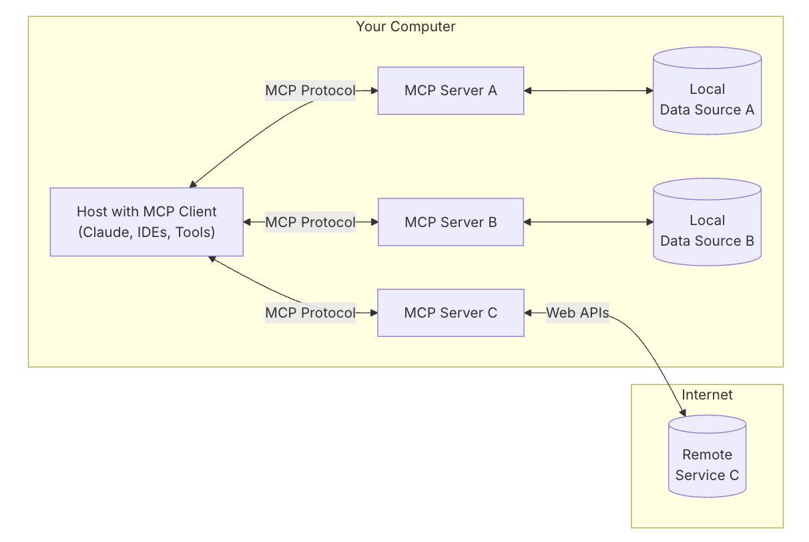

# MCP, A2A, and OpenTools Analysis

---
## Terminology
---
### Key Terms and Definitions
<details - open>
<summary>Glossary of Essential Terms Used in this Report</summary>

---
- **MCP (Model Context Protocol):**
    - An open standard protocol by Anthropic for standardizing communication between AI applications (MCP Clients) and external data sources/tools (MCP Servers), focusing on context sharing, memory, and persistence.
- **A2A (Agent-to-Agent) Communication:**
    - An open protocol by Google for standardizing direct communication, task delegation, and collaboration between independent AI agents, regardless of their underlying frameworks.
- **OpenTools API:**
    - A specific API service (from opentools.com) that acts as an MCP client abstraction, providing a unified, OpenAI-compatible endpoint for LLMs to access a registry of tools (MCP servers) managed by OpenTools.
- **General LLM Tool Calling (e.g., OpenAI Functions/Tools):**
    - A capability provided by LLM APIs (like OpenAI's) allowing the LLM to request the invocation of external functions or tools. The application code is responsible for defining, executing these tools, and returning results to the LLM.
- **Agent:**
    - An autonomous or semi-autonomous system, often powered by an LLM, capable of perceiving its environment, making decisions, and taking actions to achieve specific goals.
- **Context Sharing:**
    - Mechanisms for propagating relevant information (user history, session data, intermediate results) to models or agents.
- **Memory Management (in GenAI):**
    - Strategies for how AI models retain and access context over time, including short-term and long-term memory.
- **Persistence (in GenAI):**
    - Durable storage of context beyond a single session, allowing retrieval for continuity.
- **JSON-RPC 2.0:**
    - A remote procedure call protocol encoded in JSON. Used by A2A.
- **SSE (Server-Sent Events):**
    - A web technology allowing a server to push real-time updates to a client over an HTTP connection. Used by MCP and A2A.
- **Agent Card (A2A):**
    - A standard metadata file (JSON) exposed by an A2A-compatible agent, describing its capabilities, endpoint, and authentication requirements for discovery.
- **MCP Server:**
    - A service exposing tools or resources (e.g., databases, APIs) via the Model Context Protocol.
- **MCP Client:**
    - An application or agent that communicates with an MCP Server to utilize its tools or resources.
- **LLM (Large Language Model):**
    - A type of AI model trained on vast amounts of text data to understand, generate, and manipulate human language.
- **API (Application Programming Interface):**
    - A set of rules and protocols that allows different software applications to communicate with each other.
- **SDK (Software Development Kit):**
    - A collection of software development tools in one installable package, facilitating application creation for a specific platform or system.
- **IBM watsonx.ai:**
    - An enterprise AI and data platform by IBM, offering tools to build, train, deploy, and manage AI models.

---
</details>

---
## Model Context Protocol (MCP)
---
### MCP Comprehensive Guide
<details - open>
<summary>Understanding and Implementing the Model Context Protocol</summary>

---
#### Core Concepts, Principles, and Functionality of MCP
<details - open>
<summary>Fundamental aspects of MCP including its purpose and architecture</summary>

---
- **Protocol Fundamentals:**
    - MCP was launched by Anthropic in late 2024.
    - MCP is an open standard protocol specifically designed to standardize the communication pathways between AI applications and external data sources and tools, much like a `USB-C` port for AI.
- **Core Problem Solved by MCP:**
    - This standardization addresses the traditional "`M×N`" integration problem, where multiple AI applications (M) and multiple data sources or tools (N) required custom connectors, leading to duplicated effort and maintenance overhead.
    - MCP transforms this into an "`M+N`" problem by allowing tool creators to build MCP servers for their data sources and application developers to build MCP clients for AI applications.
    - This reduces development time and maintenance costs.
- **Key Components in MCP Ecosystem:**
    - **MCP Hosts:**
        - Main AI-powered applications users interact with (e.g., Claude Desktop, IDEs, custom AI agents).
        - They manage client instances and control access permissions.
    - **MCP Clients:**
        - Typically LLM-powered applications or agents that maintain one-to-one connections with servers.
        - Handle the communication protocol and negotiate capabilities.
        - The host application usually contains the client.
    - **MCP Servers:**
        - Lightweight programs or services that expose specific capabilities (tools, resources) through the standard protocol.
        - Link to local data sources or remote services.
- **How MCP Enables Tool Interaction:**
    - MCP allows AI models to:
        - Access immediate information beyond their training data.
        - Query databases specifically.
        - Connect to specialized services (e.g., video processing).
        - Save information to files.
        - Run actions in external systems.
- **Standard Building Blocks of MCP:**
    - **Tools:** Functions AI models can use for specific actions (e.g., API requests, running commands, database searches).
    - **Resources:** Structured data streams (e.g., files, database records, API responses) that send context to the AI model.
    - **Prompts:** Templates guiding AI models on how to best use available tools and resources, ensuring consistency.
- **Communication Methods in MCP:**
    - **Stdio (Standard Input/Output):** For local integrations, quick synchronous communication.
    - **SSE (Server-Sent Events):** For remote services, using HTTP POST streaming for lasting connections with automatic reconnection.
    - **Custom Transports:** Developers can implement custom methods for specific network protocols.
- **Context Sharing:**
    - Defines mechanisms for propagating contextual information (e.g., user history, session data, intermediate results) to relevant models or agents.
    - May involve structured context objects, standardized formats, or specific context exchange protocols.
- **Memory Management:**
    - Addresses how models retain and access context over time.
    - Includes strategies for short-term memory (e.g., current conversation turn) and long-term memory (e.g., user preferences, historical interactions).
    - Techniques might involve summarization, embedding, or retrieval from vector stores.
- **Persistence:**
    - Concerns the durable storage of context beyond a single session or interaction.
    - Allows context to be retrieved later, enabling continuity across different sessions or for asynchronous tasks.
    - May involve databases (SQL, NoSQL), file systems, or specialized context stores.
- **MCP Architecture Overview:**

The conceptual architecture is based on information from [modelcontextprotocol.io](https://modelcontextprotocol.io/introduction):



---
</details>

#### MCP Implementation Patterns and Guidance
<details - open>
<summary>Practical Approaches and Strategies for Integrating MCP</summary>

---
- **Setting up a Basic MCP Server and Client (Python Example):**
    - **Folder Structure:**
      ```
      .
      ├── client.py      # MCP client implementation
      └── server.py      # MCP server with tools
      ```
    - **Installation:**
      ```bash
      pip install trafilatura "mcp[cli]" uvicorn
      ```
    - **`server.py` (Example Web Scraper Tool):**
      ```python
      from mcp.server.fastmcp import FastMCP
      import trafilatura

      mcp_app = FastMCP("Web Scraper MCP Server") # Renamed 'mcp' to 'mcp_app' to avoid conflict

      @mcp_app.tool() # Corrected to use mcp_app
      def crawl_text_from_url(url: str) -> str:
          """
          Crawls and extracts clean text from a webpage using Trafilatura.
          """
          downloaded = trafilatura.fetch_url(url)
          if not downloaded:
              return "Failed to download the webpage."
          text = trafilatura.extract(downloaded)
          return text or "No extractable content found."

      if __name__ == "__main__":
          import uvicorn
          # To run: uvicorn server:mcp_app --host 0.0.0.0 --port 8000
          # Note: The FastMCP instance itself is the ASGI app.
          uvicorn.run(mcp_app, host="0.0.0.0", port=8000)
      ```
    - **`client.py` (Example Client):**
      ```python
      from mcp import ClientSession, StdioServerParameters # StdioServerParameters for local process
      from mcp.client.stdio import stdio_client
      # For HTTP/SSE connection to a running server:
      # from mcp.client.sse import sse_client
      # from mcp import SseServerParameters

      # Example using Stdio (running server.py as a subprocess)
      # Ensure server.py is executable or called via python interpreter
      server_stdio_params = StdioServerParameters(
          command="python", # Command to run the server
          args=["server.py"], # Arguments for the command
          # working_directory="path/to/your/server_script_directory" # Optional: if needed
      )

      # Example using SSE (connecting to a server started with uvicorn)
      # server_sse_params = SseServerParameters(url="http://localhost:8000")


      async def run_stdio_client():
          async with stdio_client(server_stdio_params) as (read, write):
              async with ClientSession(read, write) as session:
                  await session.initialize()
                  print("MCP Client Initialized (Stdio). Available tools:")
                  for tool_name, tool_def in session.tools.items():
                      print(f"- {tool_name}: {tool_def.description}")

                  url = "https://modelcontextprotocol.io/introduction" # Example URL
                  print(f"Calling tool 'crawl_text_from_url' with URL: {url}")
                  result = await session.call_tool("crawl_text_from_url", arguments={"url": url})

                  print("\nExtracted Content:")
                  print(result[:500] + "..." if result and len(result) > 500 else result)

      if __name__ == "__main__":
          import asyncio
          print("Running Stdio Client example...")
          asyncio.run(run_stdio_client())
          # print("\nTo run SSE Client example, first start the server: uvicorn server:mcp_app --port 8000")
          # print("Then uncomment and run: asyncio.run(run_sse_client())")
      ```
    - **Execution:**
        - To run the Stdio example:
          ```bash
          python client.py
          ```
        - To run the SSE example (conceptual, as `client.py` is set for Stdio):
            1.  Start the server: `uvicorn server:mcp_app --host 0.0.0.0 --port 8000`
            2.  Modify `client.py` to use `run_sse_client()` and `SseServerParameters`.
            3.  Run the client: `python client.py`

---
</details>

#### MCP Use Cases and Advantages
<details - open>
<summary>Key Scenarios and Benefits of Using the MCP</summary>

---
- **Advantages:**
    - **Greater contextual understanding and relevance:**
        - AI models connected via MCP can access real-time, organization-specific data rather than relying solely on static training data.
        - This leads to more accurate, relevant, and nuanced responses, enhancing AI performance across different tools and datasets.
    - **Efficient context management:**
        - MCP maintains stateful context across interactions, avoiding redundant information processing.
        - Reduces the "context switching tax" that can degrade AI performance when switching between information sources.
        - This efficient context window management optimizes how AI models use their limited token capacity.
    - **Operational efficiency and faster development:**
        - By using a common protocol, developers save time and reduce engineering overhead.
        - Avoids creating and maintaining custom integrations for each data source.
    - **Flexibility and future-proofing:**
        - MCP's modular client-server architecture and open standard design allow AI systems to dynamically discover and interact with available tools without hard-coded knowledge.
    - **Support for autonomous AI agents:**
        - MCP enables the creation of agentic AI systems that can autonomously plan, execute multi-step tasks, use APIs, and reason over organizational data.
        - Moves beyond simple chatbots or copilots to more capable AI-driven workflows.
    - **Broad ecosystem adoption and open-source support:**
        - MCP is supported by major AI providers like Anthropic, OpenAI, and Google DeepMind.
        - Integrated by companies such as Block, Apollo, Zed, and Replit.
        - Pre-built MCP servers for popular enterprise systems (Google Drive, Slack, GitHub, Postgres, etc.) are available, facilitating rapid adoption.
- **Use Cases:**
    - The MCP is widely applied across key industries, including:
        - **Industrial:** MCP connects complex industrial systems (sensors, machinery, PLCs, SCADA, enterprise systems), enabling AI to process diverse data for smarter operations.
        - **Finance:** MCP allows AI models to access real-time transaction data, fraud detection, risk assessment, and regulatory compliance, improving accuracy in financial services.
        - **Healthcare:** MCP securely streams patient data while ensuring compliance, helping AI personalize patient experiences (appointment scheduling, medication reminders, medical record management).
        - **Retail and Telecommunications:** MCP aggregates customer data from multiple systems to deliver personalized, `360-degree` customer experiences based on orders, preferences, and service status.
        - **Process Automation and Compliance:** MCP supports regulated industries by enabling audit trails, compliance checks, and automated service requests, ensuring transparency of AI data usage.
    - MCP thus acts as a standardized, secure bridge that integrates AI models with real-time data and tools across core sectors, delivering enhanced contextual intelligence and operational agility.

---
</details>

#### MCP Technical Requirements and Considerations
<details - open>
<summary>Infrastructure and Development Prerequisites for MCP</summary>

---
- **Infrastructure:**
    - **Context Storage:** Databases (e.g., PostgreSQL, MongoDB, Redis), distributed caches, or specialized vector databases for semantic context.
    - **Messaging Systems (Optional):** For message-based context propagation (e.g., Kafka, RabbitMQ).
    - **Scalable Compute:** To handle context processing and model inferences associated with tool use.
- **Development Considerations:**
    - **Context Granularity:** Defining what constitutes "context" and at what level of detail it should be managed.
    - **Serialization/Deserialization:** Efficient methods for converting context objects into storable/transmittable formats and back.
    - **Context Size Management:** Strategies to prevent context from growing excessively (e.g., summarization, truncation, relevance filtering). This is a known challenge, as current context windows can be insufficient for broad inferences.
    - **Security and Privacy:** Protecting sensitive information within the context, implementing access controls. MCP's broad permission scopes can pose risks if not managed carefully by the server implementation.
    - **Latency:** Ensuring fast retrieval and updates of context to avoid impacting user experience.
    - **Schema Evolution:** Planning for changes in the structure of context data over time.
    - **Debugging and Observability:** Tools and techniques to trace context flow and diagnose issues.
- **Security Concerns:**
    - **Indirect Prompt Injection:** Attackers can embed hidden instructions in natural language commands, potentially making AI assistants perform unauthorized actions if the MCP server executes these without proper sanitization.
    - **Broad Permission Scopes:** MCP servers, if poorly designed, might request extensive permissions (e.g., full Gmail access instead of read-only), increasing risk if compromised. Server implementers must follow least privilege.
    - **Data Aggregation Risks:** Partial breaches of multiple, poorly secured MCP servers could allow attackers to piece together data.
    - **Production Readiness:** Composio notes that MCP, despite merits, can be tough for production due to security and reliability issues if integrating multiple *third-party* or poorly built MCP servers. Self-built, well-secured MCP servers for internal tools mitigate many of these concerns.

---
</details>
</details>

---
## Agent-to-Agent (A2A) Communication
---
### A2A Communication Detailed Guide
<details - open>
<summary>Exploring Patterns, Frameworks, and Implementation of A2A</summary>

---
#### A2A Communication Patterns
<details - open>
<summary>Understanding Agent-to-Agent Communication Mechanisms</summary>

---
- **A2A Protocol Overview:**
    - An open protocol developed by Google (announced April 2025) to standardize communication directly between independent AI agents, regardless of their underlying frameworks or vendors.
    - Focuses on how intelligent agents exchange information, delegate responsibilities, and collaborate.
    - Builds on web standards, primarily using `JSON-RPC 2.0` over `HTTP(S)` for request/response interactions.
    - Supports Server-Sent Events (SSE) for streaming real-time updates on long-running tasks.
    - Aims to enable true agentic behavior where agents run independently and cooperate without shared state or central control.
- **Key Roles in A2A:**
    - **Client Agent:** Creates and sends tasks, often originating from end-users or other system triggers.
    - **Remote Agent (or Service Agent):** Works on tasks to provide information or take action.
- **Agent Discovery via Public Cards (Agent Cards):**
    - A2A uses a discovery mechanism where agents expose a public "Agent Card".
    - This is a standard metadata file in JSON format, typically located at `/.well-known/agent.json` on the agent's host.
    - The card contains:
        - Agent's name and description.
        - Endpoint URL for A2A requests.
        - Authentication needs for secure access (supports OpenAPI security schemes).
        - Protocol version compatibility.
        - Input/output content types.
        - Detailed skills and capabilities (tasks/services it can perform, described using OpenAPI schemas).
        - Hosted/DNS Information.
    - This allows agents to dynamically query and identify other agents' capabilities.
- **Communication Models in A2A:**
    - **Request/Response with Polling:** Traditional HTTP pattern for tasks with uncertain completion times (client polls a task status endpoint).
    - **Server-Sent Events (SSE):** For real-time updates on short-running or long-running tasks, allowing servers to push updates over a persistent connection to a task-specific SSE endpoint.
    - **Push Notifications (via Callbacks):** For long-running operations where the client provides a callback URL; the remote agent pushes a notification to this URL upon task completion or significant status change.
- **Data Formats and Message Structures in A2A:**
    - **Tasks:** Basic work units with unique IDs, optional session grouping, status updates, and potentially artifacts and message history. Task lifecycle states include: `submitted`, `working`, `input-required`, `completed`, `canceled`, `failed`.
    - **Artifacts:** Structured results or formal outputs of tasks, specified using OpenAPI schemas.
    - **Messages:** Units of agent communication (e.g., for human-in-the-loop interactions).
    - **Parts:** Complete content pieces within messages in specific formats (text, JSON, images, UI features like iframes, video, web forms).
- **Underlying Communication Patterns Leveraged by A2A:**
    - **Direct Messaging (Request/Reply):**
        - One agent sends a specific request (e.g., `JSON-RPC` method call) to another agent and waits for a direct response.
        - *A2A Implementation:* `JSON-RPC 2.0` over `HTTP(S)`.
        - *Use Cases:* Task delegation where an immediate result is needed, querying another agent for specific information.
    - **Event-Driven Communication (via SSE/Callbacks):**
        - Agents react to events (task status changes) occurring within the system. A remote agent might publish status updates, and client agents receive these.
        - Decouples agents, as they don't need to maintain constant open connections for long tasks.
        - *A2A Implementation:* SSE for streaming updates, Webhook callbacks for push notifications.
        - *Use Cases:* Notifying client agents of progress on long-running tasks, triggering subsequent actions.
- **Authentication in A2A:**
    - Designed with enterprise integration in mind.
    - Works with all OpenAPI specification authentication methods (e.g., API Keys, Bearer Tokens, `OAuth 2.0`).
    - Handles identity checks outside the protocol itself, relying on standard HTTP authentication mechanisms.

---
</details>

#### A2A Coordination Mechanisms
<details - open>
<summary>Strategies for Managing Interactions and Workflows Among Agents</summary>

---
- **Task Distribution:**
    - **Centralized Orchestrator:** A master agent assigns tasks to worker agents based on availability, capability (discovered via Agent Cards), or load.
    - **Decentralized/Choreographed:** Agents follow predefined protocols or negotiate tasks among themselves, facilitated by A2A's discovery and task lifecycle.
    - **Load Balancing:** Distributing tasks to prevent any single agent from being overwhelmed (can be managed by an orchestrator or a load balancer fronting multiple instances of an agent).
- **Result Aggregation:**
    - Mechanisms for collecting and synthesizing results from multiple agents working on parts of a larger problem. A2A's "artifacts" serve as structured results.
    - May involve a designated aggregator agent or a specific protocol for agents to submit their partial results.
- **Consensus Mechanisms:**
    - Used when multiple agents might produce conflicting information or decisions, requiring a way to reach an agreement (e.g., voting, averaging). This is typically an application-layer concern on top of A2A.
- **Workflow Management:**
    - Defining and executing sequences of tasks involving multiple agents. A2A's task lifecycle and callback/SSE mechanisms support this.
    - Can be static (predefined flows) or dynamic (flows adapt based on intermediate results).
    - Frameworks like LangChain Agents or CrewAI often provide high-level abstractions for these; A2A aims to allow agents built on such frameworks to interoperate.


- **A2A Architecture Overview:**

The conceptual architecture is based on information from [google-a2a](https://google-a2a.github.io/A2A/latest/):


---
</details>

#### A2A Implementation Frameworks, Tools, and Libraries
<details - open>
<summary>Overview of Technologies Supporting A2A System Development</summary>

---
- **General Purpose Communication Libraries (for building A2A agents):**
    - HTTP client/server libraries: `requests`, `aiohttp`, `Flask`, `FastAPI` (Python); `Axios`, `Express.js` (Node.js).
    - `JSON-RPC` libraries for various languages.
    - SSE client/server libraries.
- **Agent-Specific Frameworks (that A2A aims to help interoperate):**
    - **LangChain Agents:** Provides tools for creating agents that can use tools, plan, and interact. Supports various agent types (e.g., ReAct, Self-Ask).
    - **AutoGen (Microsoft):** Enables development of LLM applications using multiple agents that can converse with each other to solve tasks.
    - **CrewAI:** A framework for orchestrating role-playing, autonomous AI agents. Designed for collaborative tasks.
    - **Google's Agent Development Kit (ADK):** Mentioned as supporting A2A and MCP.
- **Custom Implementations:**
    - Building A2A communication from scratch using standard networking protocols and message queues, offering maximum flexibility but requiring more development effort. A2A provides the protocol specification to guide this.

- **Conceptual A2A Workflow Example (Blog Post Generation):**
    ```mermaid
        graph TD
            A[💡 User Request: Write AI Blog Post] --> B(🤵 Manager Agent);

            subgraph Task Delegation & Execution
                B -- Assigns Crawling Task --> C{🌐 Crawler Agent};
                C -- Confirms Scope (e.g., AI in Healthcare) --> B;
                C -- Crawls Data & Sends to Writer --> D(✍️ Writer Agent);
                D -- Writes Draft & Sends to Plagiarism Checker --> E(🔎 Plagiarism Check Agent);
                E -- Checks & Sends Result (Pass/Fail) + Article --> D;
                D -- If Fail, Revises or Requests More Data from C --> C;
                D -- If Pass, Sends Final Draft to Manager --> B;
            end

            subgraph Feedback Loop (Optional)
                B -- Reviews Draft & Sends Feedback --> D;
                D -- Revises Based on Feedback --> B;
            end

            B -- Sends Final Article to User/System --> F[✅ Blog Post Ready];

            style A fill:#lightgrey,stroke:#333
            style B fill:#lightblue,stroke:#333
            style C fill:#lightgreen,stroke:#333
            style D fill:#lightyellow,stroke:#333
            style E fill:#orange,stroke:#333
            style F fill:#lightgrey,stroke:#333
        end
    ```

**NOTE:** Assuming the Agents have been deployed locally, now call the Agents through API (localhost)

**Manager Agent (port 5000)**

```python
    # manager_agent.py
    from flask import Flask, request, jsonify
    import requests

    app = Flask(__name__)
    CRAWLER_URL = "http://localhost:5001/jsonrpc"

    @app.route('/jsonrpc', methods=['POST'])
    def jsonrpc():
        req = request.get_json()
        method = req.get('method')
        params = req.get('params', {})

        if method == "confirm_scope":
            print("Manager: Confirming scope for Crawler Agent.")
            return jsonify({"jsonrpc": "2.0", "result": "AI Blog", "id": req.get('id')})

        elif method == "send_report":
            article = params.get("article", "")
            print(f"\nManager: Received article & report from Crawler Agent:\n{article}\n")
            feedback = "Please add real-life examples"
            print("Manager: Sending feedback to Crawler Agent.")
            payload = {
                "jsonrpc": "2.0",
                "method": "feedback",
                "params": {"feedback": feedback},
                "id": 1
            }
            requests.post(CRAWLER_URL, json=payload)
            return jsonify({"jsonrpc": "2.0", "result": "Manager has sent feedback", "id": req.get('id')})

        elif method == "final_output":
            article = params.get("article", "")
            print(f"\n=== FINAL OUTPUT RECEIVED BY MANAGER ===\n{article}\n")
            return jsonify({"jsonrpc": "2.0", "result": "Manager has received the final article!", "id": req.get('id')})

        return jsonify({"jsonrpc": "2.0", "error": "Unknown method", "id": req.get('id')})

    @app.route('/start_workflow', methods=['POST'])
    def start_workflow():
        print("Manager: Assigning blog crawling task to Crawler Agent.")
        payload = {
            "jsonrpc": "2.0",
            "method": "crawl_blog",
            "params": {},
            "id": 1
        }
        r = requests.post(CRAWLER_URL, json=payload)
        return jsonify({"status": "Blog crawling task assigned", "crawler_response": r.json()})

    if __name__ == '__main__':
        app.run(port=5000)
```

**Crawler Agent (port 5001)**

```python
# crawler_agent.py
from flask import Flask, request, jsonify
import requests

app = Flask(__name__)
MANAGER_URL = "http://localhost:5000/jsonrpc"
WRITER_URL = "http://localhost:5002/jsonrpc"
PLAGIARISM_URL = "http://localhost:5003/jsonrpc"

@app.route('/jsonrpc', methods=['POST'])
def jsonrpc():
    req = request.get_json()
    method = req.get('method')
    params = req.get('params', {})

    if method == "crawl_blog":
        print("Crawler: Received crawl task from Manager.")
        # Ask Manager for scope
        payload = {
            "jsonrpc": "2.0",
            "method": "confirm_scope",
            "params": {},
            "id": 1
        }
        r = requests.post(MANAGER_URL, json=payload)
        scope = r.json().get("result", "AI Blog")
        print(f"Crawler: Collecting data on topic '{scope}'.")
        # Send data to Writer Agent
        data = f"Blog data on {scope}, AI applications in daily life"
        title = "AI Applications in Daily Life"
        payload = {
            "jsonrpc": "2.0",
            "method": "write_article",
            "params": {
                "data": data,
                "title": title,
                "crawler_callback": "http://localhost:5001/writer_result"
            },
            "id": 1
        }
        print("Crawler: Sending writing task to Writer Agent.")
        requests.post(WRITER_URL, json=payload)
        return jsonify({"jsonrpc": "2.0", "result": "Writing task sent", "id": req.get('id')})

    elif method == "feedback":
        feedback = params.get("feedback", "")
        print(f"Crawler: Received feedback from Manager, forwarding to Writer: {feedback}")
        payload = {
            "jsonrpc": "2.0",
            "method": "revise_article",
            "params": {"feedback": feedback, "crawler_callback": "http://localhost:5001/writer_result"},
            "id": 1
        }
        requests.post(WRITER_URL, json=payload)
        return jsonify({"jsonrpc": "2.0", "result": "Feedback sent to Writer", "id": req.get('id')})

    return jsonify({"jsonrpc": "2.0", "error": "Unknown method", "id": req.get('id')})

@app.route('/writer_result', methods=['POST'])
def writer_result():
    data = request.get_json()
    article = data.get("article", "")
    print("Crawler: Received article from Writer, sending report to Manager.")
    # Send article to Manager
    payload = {
        "jsonrpc": "2.0",
        "method": "send_report",
        "params": {"article": article},
        "id": 1
    }
    requests.post(MANAGER_URL, json=payload)
    # Send to Plagiarism Check Agent
    print("Crawler: Sending article to Plagiarism Check Agent.")
    requests.post(PLAGIARISM_URL, json={
        "jsonrpc": "2.0",
        "method": "check_plagiarism",
        "params": {"article": article, "crawler_callback": "http://localhost:5001/plagiarism_result"},
        "id": 1
    })
    return '', 204

@app.route('/plagiarism_result', methods=['POST'])
def plagiarism_result():
    data = request.get_json()
    result = data.get("result")
    article = data.get("article")
    if result == "pass":
        print("Crawler: Article passed plagiarism check, sending to Manager.")
        payload = {
            "jsonrpc": "2.0",
            "method": "final_output",
            "params": {"article": article},
            "id": 1
        }
        requests.post(MANAGER_URL, json=payload)
    else:
        print("Crawler: High plagiarism detected, asking Writer to revise.")
        payload = {
            "jsonrpc": "2.0",
            "method": "revise_article",
            "params": {
                "feedback": "High plagiarism detected, please expand the content!",
                "crawler_callback": "http://localhost:5001/writer_result"
            },
            "id": 1
        }
        requests.post(WRITER_URL, json=payload)
    return '', 204

if __name__ == '__main__':
    app.run(port=5001)
```

**Writer Agent (port 5002)**

```python
# writer_agent.py
from flask import Flask, request, jsonify
import requests

app = Flask(__name__)

@app.route('/jsonrpc', methods=['POST'])
def jsonrpc():
    req = request.get_json()
    method = req.get('method')
    params = req.get('params', {})
    if method == "write_article":
        print("Writer: Received writing task from Crawler.")
        article = f"{params.get('title')}\n{params.get('data')}\nDetailed content about AI..."
        callback = params.get("crawler_callback")
        print("Writer: Sending article back to Crawler.")
        requests.post(callback, json={"article": article})
        return jsonify({"jsonrpc": "2.0", "result": "Article written", "id": req.get('id')})

    elif method == "revise_article":
        feedback = params.get("feedback", "")
        print(f"Writer: Received feedback from Crawler, revising article: {feedback}")
        article = f"Revised article based on feedback: {feedback}\nExpanded content about AI..."
        callback = params.get("crawler_callback")
        print("Writer: Sending revised article back to Crawler.")
        requests.post(callback, json={"article": article})
        return jsonify({"jsonrpc": "2.0", "result": "Article revised", "id": req.get('id')})

    return jsonify({"jsonrpc": "2.0", "error": "Unknown method", "id": req.get('id')})

if __name__ == '__main__':
    app.run(port=5002)
```


**Plagiarism Check Agent (port 5003)**

```python
# plagiarism_agent.py
from flask import Flask, request, jsonify
import random
import requests

app = Flask(__name__)

@app.route('/jsonrpc', methods=['POST'])
def jsonrpc():
    req = request.get_json()
    method = req.get('method')
    params = req.get('params', {})
    if method == "check_plagiarism":
        article = params.get("article")
        callback = params.get("crawler_callback")
        print("Plagiarism: Checking for plagiarism...")
        result = "pass" if random.random() < 0.7 else "fail"
        print(f"Plagiarism: Check result: {result}")
        requests.post(callback, json={"result": result, "article": article})
        return jsonify({"jsonrpc": "2.0", "result": "Checked", "id": req.get('id')})

    return jsonify({"jsonrpc": "2.0", "error": "Unknown method", "id": req.get('id')})

if __name__ == '__main__':
    app.run(port=5003)
```


 **Start Workflow**

```python
# start_workflow.py
import requests

MANAGER_URL = "http://localhost:5000/start_workflow"
r = requests.post(MANAGER_URL)
print(r.json())
```

---
</details>

#### A2A Use Cases and Advantages
<details - open>
<summary>Scenarios Where A2A Offers Significant Benefits and Its Key Strengths</summary>

---
- **Multi-Agent Systems Across Different Data Setups:**
    - When agents from different vendors or built on different frameworks need to collaborate.
- **Enterprise Workflow Automation:**
    - Automating complex processes that span multiple departments or systems (e.g., HR, IT, finance).
    - Example: A hiring workflow where sourcing, screening, scheduling, and background check agents collaborate.
- **Customer Support Systems:**
    - Coordinating multiple backend systems (chatbots, billing, inventory, knowledge bases) to resolve customer issues.
- **End-to-End Process Management:**
    - Managing processes like employee onboarding across various departments.
- **Travel Planning:**
    - A travel assistant agent connecting to specialized train booking, hotel booking, and cab service agents.
- **Productivity Suites:**
    - An assistant agent delegating tasks to a calendar agent (which might use MCP for Google Calendar access) and a document agent (which might use MCP for Notion/Google Docs access).
- **Advantages of A2A:**
    - **True Agentic Behavior:** Agents run independently and cooperate without shared state or central control.
    - **Familiar Tech Stack:** Uses `HTTP` + Server-Sent Events + `JSON-RPC`, fitting into existing backend workflows.
    - **Enterprise-Grade Security:** Built-in authentication/authorization based on OpenAPI standards.
    - **Handles Short- or Long-Running Tasks:** Supports real-time progress, state tracking, and human-in-the-loop via defined task lifecycles.
    - **Modality-Agnostic:** Can handle text, audio, video, and other rich media through its "Parts" mechanism.
    - **Open and Extensible:** Contributions from over `50` tech companies. Built on existing standards.
    - **Secure by Default:** Supports authentication based on widely used identity frameworks like OpenID Connect.

---
</details>

#### A2A Scalability Considerations
<details - open>
<summary>Addressing Performance and Growth in Multi-Agent Systems</summary>

---
- **Number of Agents:**
    - As the number of agents increases, communication overhead can become significant.
    - Consider asynchronous communication patterns (supported by A2A) and efficient agent discovery mechanisms (A2A's Agent Cards).
- **Complexity of Workflows:**
    - Complex dependencies between agents can lead to bottlenecks and increased latency.
    - Design workflows for parallelism where possible. A2A's task management can help track these.
- **Message Volume and Size:**
    - High volumes of messages or large message payloads can strain network and processing resources.
    - Optimize message formats (A2A uses "parts" for content negotiation) and consider data compression.
- **State Management:**
    - Managing shared state across many agents can be challenging. A2A promotes agent independence to mitigate this, but application-level state may still be needed.
    - Evaluate trade-offs between consistency, availability, and partition tolerance (CAP theorem) for any shared state stores.
- **Discovery and Registration:**
    - How agents find and connect with each other, especially in dynamic environments. A2A's `/.well-known/agent.json` standardizes this.
    - Service discovery mechanisms (e.g., Consul, ZooKeeper, Kubernetes services) might be needed for underlying infrastructure hosting the agents.
- **Fault Tolerance:**
    - Design for failures of individual agents or communication links. Implement retries, dead-letter queues, and graceful degradation. A2A's task lifecycle includes `failed` and `canceled` states.
- **Security Considerations for A2A:**
    - **Authorization Boundaries:** Crucial for setting agent permissions and data access limits. Requires clear diagrams of services, connections, and data flow permissions.
    - **Cross-Domain Security:** External services handling sensitive data must be part of the authorization boundary or have matching security levels.
    - **Service Authentication:** Relies on OpenAPI specification methods (API Keys, Bearer Tokens, `OAuth 2.0`).

---
</details>
</details>

---
## LLM Tool Calling and OpenTools API
---
### General LLM Tool Calling (e.g., OpenAI Functions/Tools)
<details - open>
<summary>Understanding LLM Interaction with External Functions (Application-Executed)</summary>

---
- **Core Concept:**
    - Enables LLMs to interact with external systems, APIs, and data sources by "calling functions" or "using tools."
    - The LLM decides *which* tool to use and *what parameters* to pass, based on user prompt and tool descriptions provided by the application.
    - The *application code* is responsible for actually executing the tool/function and returning the output to the LLM.
- **Typical Workflow:**
    - User provides a prompt to the LLM via an application.
    - The application also provides the LLM with a list of available tools (function signatures and descriptions).
    - The LLM, based on the prompt, determines if a tool needs to be called.
    - If so, the LLM outputs a structured request (e.g., JSON) indicating the tool name and arguments.
    - The application code receives this request, executes the specified tool/function with the provided arguments.
    - The tool's output is returned by the application to the LLM.
    - The LLM uses this output to formulate a final response to the user.
- **Integration Patterns:**
    - **Single LLM with Multiple Tools:** A primary LLM is equipped with a set of tools it can choose to use, managed by the application.
    - **Tool-Using Agents:** An agent (which might be an LLM wrapper) is specifically designed by the application to use one or more tools as its primary function.
- **Use Cases:**
    - **Retrieving Real-time Information:** Accessing current news, stock prices, weather forecasts (application calls the respective APIs).
    - **Interacting with External APIs:** Booking flights, ordering food, managing calendar events (application handles the API integrations).
    - **Accessing Proprietary Data:** Querying internal company databases or knowledge bases (application provides the data access layer).
    - **Performing Calculations or Data Transformations:** Using specialized libraries or services (application invokes these).
    - **Executing Code:** Running scripts or commands in a controlled environment (application manages execution; requires careful security).
- **Integration Approaches:**
    - **Direct API Integration:** Application code directly calls LLM APIs (e.g., OpenAI API) and handles tool execution logic.
    - **Using Frameworks:** Libraries like LangChain provide abstractions for defining tools and integrating them with LLMs, simplifying the process for the application developer.
    - **Serverless Functions:** Hosting tool execution logic in serverless functions (e.g., AWS Lambda, Google Cloud Functions) for scalability and isolation, invoked by the application.

- **Example: General Tool Calling with OpenAI API (Conceptual Python):**
    - *This illustrates the general idea; actual implementation requires handling the `tool_calls` response from the first LLM call, executing the function, and making a subsequent API call with the function's result.*
    ```python
    import openai
    import json

    # Ensure your OpenAI API key is set as an environment variable or configured
    # client = openai.OpenAI(api_key="YOUR_API_KEY") # Replace with your key or use env var

    # Example function to be called by the LLM (executed by your application)
    def get_current_weather(location, unit="fahrenheit"):
        """Get the current weather in a given location"""
        if "tokyo" in location.lower():
            return json.dumps({"location": "Tokyo", "temperature": "10", "unit": "celsius"})
        elif "san francisco" in location.lower():
            return json.dumps({"location": "San Francisco", "temperature": "72", "unit": "fahrenheit"})
        else:
            return json.dumps({"location": location, "temperature": "unknown"})

    def run_conversation():
        client = openai.OpenAI() # Assumes OPENAI_API_KEY is set in environment
        messages = [{"role": "user", "content": "What's the weather like in San Francisco and Tokyo?"}]
        tools = [
            {
                "type": "function",
                "function": {
                    "name": "get_current_weather",
                    "description": "Get the current weather in a given location",
                    "parameters": {
                        "type": "object",
                        "properties": {
                            "location": {
                                "type": "string",
                                "description": "The city and state, e.g. San Francisco, CA",
                            },
                            "unit": {"type": "string", "enum": ["celsius", "fahrenheit"]},
                        },
                        "required": ["location"],
                    },
                },
            }
        ]
        
        # First call to the model
        response = client.chat.completions.create(
            model="gpt-3.5-turbo-0125",
            messages=messages,
            tools=tools,
            tool_choice="auto", 
        )
        response_message = response.choices[0].message
        tool_calls = response_message.tool_calls

        # Check if the model wants to call a function
        if tool_calls:
            messages.append(response_message) # Extend conversation with assistant's reply
            available_functions = {
                "get_current_weather": get_current_weather,
            }
            for tool_call in tool_calls:
                function_name = tool_call.function.name
                function_to_call = available_functions[function_name]
                function_args = json.loads(tool_call.function.arguments)
                function_response = function_to_call(
                    location=function_args.get("location"),
                    unit=function_args.get("unit"),
                )
                messages.append(
                    {
                        "tool_call_id": tool_call.id,
                        "role": "tool",
                        "name": function_name,
                        "content": function_response,
                    }
                )
            
            # Second call to the model with function response
            second_response = client.chat.completions.create(
                model="gpt-3.5-turbo-0125",
                messages=messages,
            )
            return second_response.choices[0].message.content
        return response_message.content # If no tool call was made

    # if __name__ == "__main__":
    #     final_answer = run_conversation()
    #     print(final_answer)
    ```
---
</details>

### OpenTools API Specific Analysis
<details - open>
<summary>Deep Dive into the OpenTools.com API for LLM Tool Use (Managed Execution)</summary>

---
- **Architecture and Core Concept:**
    - The OpenTools API (from opentools.com) functions as a Model Context Protocol (MCP) *client abstraction layer*.
    - It provides a single, OpenAI-compatible API endpoint (`/v1/chat/completions`) for LLMs to access thousands of tools from a registry of MCP servers *managed by OpenTools*.
    - This architecture simplifies tool integration for developers by handling underlying protocol details (like MCP client implementation and tool server interaction) for them.
    - The OpenTools service *executes the tool call* and grounds the response.
    - LLM and tool calls can occur in one HTTP roundtrip from the developer's perspective, rather than multiple sequential calls managed by the client application (as in General Tool Calling).
    - **Generations and Calls (Internal OpenTools Mechanism):**
        - A `Call` (ID prefix `call_`) is either an LLM call or a tool call, occurring sequentially within the OpenTools service.
        - A `Generation` (ID prefix `genr_`) corresponds to one chat completion request made to the OpenTools API and can create `1-to-N` child `Call`s (e.g., LLM → Tool → LLM).
        - A limit (e.g., `9` calls in the sequence as per OpenTools documentation) prevents runaway costs.
- **Key Capabilities of OpenTools API:**
    - Access to a wide registry of pre-integrated tools (MCP servers managed by OpenTools) like web search (e.g., `exa`), real-time data, web scraping.
    - Seamless switching between different LLM providers (e.g., Anthropic, OpenAI, Google) by changing the `model` parameter in the API call, while maintaining tool compatibility.
    - Centralized handling of authentication for various tools within the OpenTools ecosystem (developer uses one OpenTools API key).
    - Simplified billing: charges typically based on tool execution tokens, aggregated into a single bill from OpenTools.
    - Potential to use custom tools alongside registry tools (developers should check current OpenTools API documentation for specifics on custom tool integration, which may involve them hosting an MCP server that OpenTools can connect to).
- **Integration Approaches for OpenTools API:**
    - **Direct API Calls:**
        - Using HTTP POST requests to the OpenTools API endpoint (`https://api.opentools.com/v1`), similar to calling the OpenAI API.
        - Requires an OpenTools API key for authentication.
        - Tool selection is done by specifying tool references (e.g., `{"type": "mcp", "ref": "exa"}`) in the `tools` array of the API request.
    - **Using OpenAI-compatible SDKs:**
        - Since the OpenTools API is OpenAI-compatible, standard OpenAI client libraries (e.g., Python `openai` SDK) can be used by simply changing the `base_url` and `api_key`.
    - **Integration with AI Platforms (e.g., IBM watsonx.ai):**
        - The OpenTools API can be used as a component in larger AI workflows, for example, to gather data that is then processed by models on other platforms like IBM watsonx.ai.
        - This allows combining the strengths of OpenTools' data gathering capabilities with the analytical power of platforms like watsonx.ai.
- **Use Cases for OpenTools API:**
    - Building specialized assistants that require real-time information (e.g., financial research assistants, news aggregators, travel planners) using a managed toolset.
    - Augmenting LLMs with capabilities not natively available (e.g., complex calculations, specific data source access, web interaction) via pre-built tools.
    - Rapidly prototyping applications that leverage multiple external tools without managing individual API keys and integrations for each tool in the OpenTools registry.
    - Creating resilient applications that can switch LLM backends easily while using a consistent set of OpenTools-managed tools.
    - Enhancing enterprise AI solutions, such as using OpenTools API with IBM watsonx.ai to create AI models with access to powerful external tools for real-time analysis and comprehensive research.

- **Example: OpenTools API Call with cURL:**
  ```bash
  # Ensure YOUR_OPENTOOLS_API_KEY is set as an environment variable or replaced directly
  curl -X POST https://api.opentools.com/v1/chat/completions \
  -H "Authorization: Bearer $YOUR_OPENTOOLS_API_KEY" \
  -H "Content-Type: application/json" \
  -d '{
    "model": "anthropic/claude-3.5-sonnet",
    "messages": [
      {
        "role": "system",
        "content": "You are a research assistant specializing in space exploration. Provide factual information by searching for the latest developments."
      },
      {
        "role": "user",
        "content": "What is the latest on the Starliner mission?"
      }
    ],
    "tools": [
      {
        "type": "mcp",
        "ref": "exa" /* "exa" is an example tool reference for web search */
      }
    ]
  }'
  ```
---
- **Example: OpenTools API Call with Python SDK:**
  ```python
  import os
  from openai import OpenAI # OpenTools API is OpenAI-compatible
  from dotenv import load_dotenv

  load_dotenv() # Loads variables from .env file (e.g., OPENTOOLS_API_KEY)

  def gather_data_with_opentools(query_content, system_prompt, tool_ref="exa"):
      """Generic function to call OpenTools API with a specified tool."""
      client = OpenAI(
          api_key=os.getenv("OPENTOOLS_API_KEY"),
          base_url="https://api.opentools.com/v1"
      )

      try:
          response = client.chat.completions.create(
              model="anthropic/claude-3.5-sonnet", # Or any other model supported by OpenTools
              messages=[
                  {"role": "system", "content": system_prompt},
                  {"role": "user", "content": query_content}
              ],
              tools=[{"type": "mcp", "ref": tool_ref}] # Example: 'exa' for web search
          )
          return response.choices[0].message.content
      except Exception as e:
          print(f"Error calling OpenTools API: {e}")
          return None

  # Example usage:
  # if __name__ == "__main__":
  #     user_query = "Find recent news about renewable energy breakthroughs."
  #     system_message = "You are a technology news assistant. Search for and summarize recent articles."
  #     retrieved_data = gather_data_with_opentools(user_query, system_message)
  #     if retrieved_data:
  #         print("Data from OpenTools:")
  #         print(retrieved_data)
  ```
---
- **Example: Integrating OpenTools API with IBM watsonx.ai for Financial Research:**
    - *This workflow demonstrates OpenTools API gathering real-time market data, which is then analyzed by IBM watsonx.ai.*
    - **1. Setup Environment and Dependencies:**
      ```bash
      pip install openai ibm-watsonx-ai python-dotenv
      ```
    - Create a `.env` file:
      ```env
      IBM_API_KEY="your_ibm_api_key"
      IBM_PROJECT_ID="your_ibm_project_id"
      OPENTOOLS_API_KEY="your_opentools_api_key"
      ```
    - **2. Gather Real-Time Market Data (using OpenTools API):**
      ```python
      # (Uses the gather_data_with_opentools function defined above)
      # Example:
      # stock_symbol = "NVDA"
      # market_data_query = f"Find recent news, earnings data, and analyst opinions about {stock_symbol} stock. Include significant market movements from the past month."
      # market_data_system_prompt = "You are a financial research assistant. Search for and summarize recent news, earnings reports, analyst opinions, and market data about the requested stock."
      # market_data_nvda = gather_data_with_opentools(market_data_query, market_data_system_prompt, tool_ref="exa")
      # if market_data_nvda:
      #     print(f"Market Data Gathered for {stock_symbol}:\n{market_data_nvda[:500]}...")
      ```
    - **3. Analyze with IBM watsonx.ai:**
      ```python
      from ibm_watsonx_ai import APIClient # Credentials are now part of APIClient
      from ibm_watsonx_ai.foundation_models import ModelInference
      # (Ensure load_dotenv() and os are imported)

      def analyze_with_watsonx(symbol, market_data_str):
          """Analyze market data using IBM watsonx.ai"""
          try:
              client = APIClient(
                  api_key=os.getenv("IBM_API_KEY"),
                  url="https://us-south.ml.cloud.ibm.com" # Use your region's URL
              )
              project_id = os.getenv("IBM_PROJECT_ID")

              model = ModelInference(
                  model_id="ibm/granite-13b-chat-v2", # Example model
                  api_client=client,
                  project_id=project_id,
                  params={"max_new_tokens": 1024, "temperature": 0.2}
              )
              analysis_prompt = f"""
              As a senior financial analyst, analyze the following market data for {symbol} and provide:
              1. Key market developments and their potential impact
              2. Risk assessment (Low/Medium/High)
              3. Investment recommendation (Buy/Hold/Sell) with reasoning
              Market Data:
              {market_data_str}
              Provide a clear, structured analysis.
              """
              response = model.generate_text(prompt=analysis_prompt)
              return response
          except Exception as e:
              print(f"Error calling IBM watsonx.ai: {e}")
              return None
      # Example:
      # if market_data_nvda:
      #     analysis_result = analyze_with_watsonx(stock_symbol, market_data_nvda)
      #     if analysis_result:
      #         print(f"\nInvestment Analysis from IBM watsonx.ai for {stock_symbol}:\n{analysis_result}")
      ```
    - **4. Create a Comprehensive Research Report (Combining Steps):**
      ```python
      from datetime import datetime

      def create_research_report(symbol):
          """Generate a complete research report for a stock symbol"""
          print(f"🔍 Generating research report for {symbol}...")
          
          market_data_query = f"Find recent news, earnings data, and analyst opinions about {symbol} stock. Include significant market movements from the past month."
          market_data_system_prompt = "You are a financial research assistant. Search for and summarize recent news, earnings reports, analyst opinions, and market data about the requested stock."
          market_data_content = gather_data_with_opentools(market_data_query, market_data_system_prompt, tool_ref="exa")
          
          if not market_data_content:
              return f"Error: Could not gather market data for {symbol} via OpenTools API."

          print(f"📊 Market data gathered for {symbol}.")
          analysis_content = analyze_with_watsonx(symbol, market_data_content)
          if not analysis_content:
              return f"Error: Could not generate analysis for {symbol} from IBM watsonx.ai."
          print(f"🧠 AI analysis completed for {symbol}.")

          report = f"""
      INVESTMENT RESEARCH REPORT
      ===========================
      Stock Symbol: {symbol}
      Report Date: {datetime.now().strftime('%Y-%m-%d %H:%M')}
      Generated by: IBM watsonx.ai + OpenTools API

      MARKET DATA SUMMARY (via OpenTools API with 'exa' tool)
      ----------------------------------------------------
      {market_data_content}

      AI INVESTMENT ANALYSIS (via IBM watsonx.ai - granite-13b-chat-v2)
      -----------------------------------------------------------------
      {analysis_content}
          """
          return report

      # if __name__ == "__main__":
      #     # Ensure all functions (gather_data_with_opentools, analyze_with_watsonx) are defined
      #     # and environment variables are loaded.
      #     final_report_nvda = create_research_report("NVDA")
      #     print(final_report_nvda)
      #     # Optionally save to file
      #     # with open(f"NVDA_report_{datetime.now().strftime('%Y%m%d')}.txt", 'w') as f:
      #     #     f.write(final_report_nvda)
      ```
---
</details>

---
## Comparative Analysis
---
### MCP, A2A, General Tool Calling, and OpenTools API
<details - open>
<summary>Evaluating and Contrasting the Integration Approaches</summary>

---
#### Comparison Framework Criteria
<details - open>
<summary>Key Aspects for Evaluating MCP, A2A, General Tool Calling, and OpenTools API</summary>

---
- **Primary Purpose:** The main goal each approach is designed to achieve.
- **Key Focus / Locus of Control:** Where the primary interaction or control lies (e.g., agent-to-tool, agent-to-agent, application-executes-tool, service-executes-tool).
- **Context Management:** How sophisticatedly context is handled (sharing, memory, persistence).
- **Communication Complexity:** The nature and intricacy of communication supported.
- **Agent Coordination:** Capabilities for managing interactions between multiple autonomous agents.
- **External System Interaction:** Ease and effectiveness of connecting with tools/APIs outside the LLM.
- **Tool Execution Responsibility:** Who is responsible for actually running the tool's code.
- **Implementation Complexity:** Effort required to design, build, and deploy.
- **Scalability:** Ability to handle growth in load, data, or number of components.
- **Flexibility:** Adaptability to different use cases and system architectures.
- **Maturity & Standardization:** Level of industry adoption and established standards.
- **Ease of Use / Abstraction Level:** How simple it is for developers to integrate and use.
- **Tool Ecosystem & Management:** Availability of tools and how they are managed/accessed.
- **Production Readiness Factors:**
    - **Observability:** Ease of monitoring, logging, and debugging.
    - **Fault Tolerance:** Resilience to failures.
    - **Security:** Mechanisms for secure communication and data handling.
    - **Maintainability:** Ease of updating and managing the system over time.
- **Task Management:** How tasks are defined, tracked, and managed.
- **Capability Specification:** How tools or agent capabilities are defined and discovered.

---
</details>

#### Detailed Comparison Table
<details - open>
<summary>Side-by-Side Evaluation of MCP, A2A, General Tool Calling, and OpenTools API</summary>

---
| Feature/Criterion             | Model Context Protocol (MCP)                                  | Agent-to-Agent (A2A) Communication                         | General LLM Tool Calling (e.g., OpenAI) | OpenTools API (MCP Client Abstraction)                     |
|-------------------------------|---------------------------------------------------------------|------------------------------------------------------------|-----------------------------------------------------------|------------------------------------------------------------|
| **Primary Purpose**           | Standardize agent-to-tool communication for *your tools*; robust context sharing, memory, persistence. | Standardize complex interactions and coordination among independent AI agents. | Enable LLM to request external function/API calls. | Simplify LLM access to a *managed registry* of tools via a unified API. |
| **Key Focus / Locus of Control**| Agent ↔ Your External Systems/APIs (via your MCP Server); API Integration; Backend (Data/API access). | Agent ↔ Agent; Collaboration & Interoperability; Mid-layer (Agent Network). | LLM ↔ Your External Tool/Function (Your App-managed execution). | LLM ↔ Managed Tool Execution Service (Tool execution handled by OpenTools). |
| **Context Management**        | Core focus; sophisticated, potentially long-term.             | Can leverage MCP or have own context per agent/interaction; A2A itself promotes stateless agent interaction. | Primarily for current task; context passed via LLM calls, managed by app. | Leverages MCP principles for tools; context managed by LLM calls and potentially by underlying MCP tools. |
| **Communication Complexity**  | Moderate (Client-Server); defined transports (Stdio, SSE, Custom). | High; diverse patterns (`JSON-RPC` over `HTTP(S)`, SSE, Callbacks). | Simple; LLM requests tool use, app executes & returns.    | Very Simple for developer (single API call); MCP complexity abstracted by OpenTools. |
| **Agent Coordination**        | Indirectly supports via shared context.                       | Core focus; task distribution, result aggregation, discovery via Agent Cards. | Not a primary feature; typically single LLM directs, app orchestrates. | Not a primary feature; focused on single LLM to tool.     |
| **External System Interaction**| Core focus; connects AI models to *your* external tools and data sources via *your* MCP Servers. | Agents can be designed to interact with external systems, potentially using MCP for tool access. | Core focus; designed for LLM to call external tools defined/executed by *your app*. | Core focus; provides managed access to external tools in *its registry*.      |
| **Tool Execution Responsibility**| Your MCP Server executes the tool.                           | The respective agent (or system it controls) executes the action/tool. | Your application code executes the tool.                  | The OpenTools service executes the tool from its registry. |
| **Implementation Complexity** | Moderate to High (for *your* MCP server implementation).      | High (managing multiple agents, comms, coordination, Agent Card exposure). | Low to Moderate (for tool definition & *your app's* execution logic).  | Very Low (for API user); OpenTools handles MCP client and tool execution complexity. |
| **Scalability**               | Depends on context store scalability and *your* server performance. | Challenging; requires careful design for many agents, but A2A provides foundational standards. | Scales with LLM provider and *your app's* tool execution infra. | Scales with OpenTools service; user relies on their infrastructure. |
| **Flexibility**               | High for context-rich applications and standardized access to *your own tools*. | Very high for distributed, autonomous systems from different vendors. | Moderate; focused on LLM-tool interaction with *app-defined tools*. | Moderate; limited by OpenTools' tool registry and API capabilities, but high for LLM backend switching. |
| **Maturity & Standardization**| Open standard by Anthropic (late 2024), growing adoption.     | Open protocol by Google (April 2025), backed by `50+` tech companies. | Becoming standardized by LLM providers (e.g., OpenAI).   | Proprietary API (OpenAI-compatible) by OpenTools.com; leverages MCP. |
| **Transport Methods**         | Stdio, SSE, Custom.                                           | `JSON-RPC 2.0` over `HTTP(S)`, SSE, Push Callbacks.        | Typically `HTTPS` to LLM provider API; app handles tool transport. | `HTTPS` to OpenTools API.                                  |
| **Data Formats**              | Tools, Resources, Prompts (defined by *your* MCP server).     | Tasks, Artifacts, Messages, Parts (defined by A2A spec using OpenAPI). | LLM-specific tool call format (often JSON, defined by *your app*). | OpenAI-compatible JSON for requests; tool specifics abstracted. |
| **Authentication (to tools)** | Handled by *your* MCP server/client (`OAuth 2.1`, API Keys).  | N/A (A2A auth is agent-to-agent).                          | Handled by *your application code* calling the tool.      | Handled by OpenTools service for registry tools.            |
| **Security Concerns**         | Prompt injection, broad permissions (if *your server* is poorly designed), data aggregation. | Authorization boundaries, cross-domain security for agents. | Prompt injection, secure tool execution by *your app*.    | Trust in OpenTools service security, data handling; prompt injection. |
| **Ideal Use Cases**           | Dev environments, direct tool access to *your* systems, live coding context, rich user session context. | Multi-agent workflows, cross-system automation, enterprise processes, inter-vendor agent collaboration. | Quick external data lookups, specific API actions executed by *your app*. | Rapid prototyping with diverse tools, abstracting LLM/tool backends, integrating with platforms like IBM watsonx. |
| **Task Management**           | Single-stage execution (tool call).                           | Multi-stage lifecycle (pending, running, etc.).             | Typically single request/response for tool call (*app manages*). | Single API call to OpenTools; internal calls managed by OpenTools. |
| **Capability Specification**  | Low-level, instruction-based (JSON Schema for tools in *your server*). | High-level, goal-oriented (Agent Cards using OpenAPI schemas). | Function signatures/descriptions provided to LLM by *your app*. | Tools referenced by name (e.g., `exa`); capabilities defined by OpenTools registry. |

---
</details>

#### Strengths and Weaknesses Analysis
<details - open>
<summary>Advantages and Disadvantages of Each Integration Approach</summary>

---
- **MCP (Model Context Protocol):**
    - *Strengths:*
        - Excellent for maintaining deep, long-term context for AI models.
        - Enhances coherence and personalization in interactions.
        - Enables stateful applications by standardizing context sharing.
        - Standardizes agent-tool connections for *your own tools/systems*, reducing "`M×N`" integration complexity.
        - Full control over your tool implementation, security, and data handling when you build the MCP server.
    - *Weaknesses:*
        - Can be complex to design and manage your own MCP servers effectively.
        - Potential for your context store to be a bottleneck if not designed for scale.
        - Security risks from prompt injection and broad permissions if your MCP server is not carefully implemented with least privilege.
        - LLM context windows can still be a limitation for tools requiring very broad inferences from large context.
        - Composio notes potential reliability issues for production if integrating multiple *third-party* or poorly built MCP servers.
- **A2A (Agent-to-Agent) Communication:**
    - *Strengths:*
        - Highly flexible for building complex, distributed systems of autonomous agents, even from different vendors.
        - Supports sophisticated collaboration, task delegation, and dynamic discovery.
        - Enterprise-grade security concepts built-in (uses OpenAPI security schemes).
        - Modality-agnostic (can handle various data types).
        - Promotes agent independence and interoperability.
    - *Weaknesses:*
        - High implementation and operational complexity, even with a standard.
        - Challenging to debug and scale without careful design of agents and their interactions.
        - Coordination and consensus among many agents can be difficult to get right.
        - Relatively new protocol, so best practices and tooling are still emerging.
- **General LLM Tool Calling (e.g., OpenAI Functions/Tools):**
    - *Strengths:*
        - Relatively simple to implement for LLM-driven tool use where the application controls the tools.
        - Directly extends LLM capabilities to interact with the real world via *application-defined and executed tools*.
        - LLM provider handles the "decision to call"; application developer focuses on tool logic.
        - Full control over tool execution logic, security, and data handling within the application.
    - *Weaknesses:*
        - Application code must execute the tool and return results to the LLM (multi-step interaction with LLM).
        - Limited in managing complex, ongoing context across multiple interactions without additional MCP-like support or custom state management by the app.
        - Not inherently designed for multi-agent coordination beyond simple orchestration by the application.
        - Each new tool requires custom integration code in the application.
- **OpenTools API (MCP Client Abstraction):**
    - *Strengths:*
        - Very easy to integrate tool usage for LLMs using an OpenAI-compatible API.
        - Abstracts away MCP client implementation and tool execution complexity for tools in its registry.
        - Single API for multiple tools and potentially multiple LLM backends.
        - Centralized billing/authentication for tools in its registry.
        - Facilitates rapid prototyping and integration with other platforms (e.g., IBM watsonx.ai).
        - Handles the multi-step LLM-tool-LLM interaction behind a single API call.
    - *Weaknesses:*
        - Dependency on OpenTools.com service availability, reliability, and performance.
        - Tool availability limited to their registry (custom tool integration might be complex or require you to host an MCP server they can access).
        - Less control over the tool execution environment, security, and data handling compared to self-hosting MCP servers or direct tool calls.
        - Potential cost implications of using a managed service (pay-per-tool-call tokens).
        - Vendor lock-in to OpenTools for access to its specific tool registry and abstraction benefits.

---
</details>

#### Scenario-Based Suitability
<details - open>
<summary>When to Choose MCP, A2A, General Tool Calling, or OpenTools API</summary>

---
- **Choose MCP when:**
    - Building sophisticated chatbots or virtual assistants requiring long conversation memory and access to *your internal systems*.
    - Applications demand deep personalization based on extensive user history stored and managed by *your systems*.
    - Stateful, multi-step workflows where context must be preserved and evolved, and *your agents/models* need standardized access to *your tools*.
    - You need to build and manage your own standardized tool servers for *your agents/models* to access proprietary data or specific internal systems.
    - Runtime tool discovery for *your internal tools* is preferred over pre-programmed connections.
    - Example: Claude Desktop using MCP to access local files while maintaining data privacy.
- **Choose A2A Communication when:**
    - Developing systems with multiple specialized AI agents (potentially from different vendors) that need to collaborate, delegate tasks, and operate autonomously.
    - Complex problem-solving that can be broken down and tackled by different autonomous agents (e.g., enterprise workflows like hiring, customer support involving multiple backends).
    - Building simulated environments or agent-based models requiring inter-agent dialogue and coordination.
    - Interoperability between agents built on different platforms is a key requirement.
- **Choose General LLM Tool Calling (e.g., OpenAI Functions) when:**
    - An LLM needs to access real-time information (e.g., weather, news) via an API *your application integrates, executes, and secures*.
    - An LLM needs to perform actions via external APIs (e.g., booking, ordering) where *your application handles the API call logic and security*.
    - Integrating LLMs with existing enterprise systems or databases for data retrieval or updates in a more direct, LLM-centric way, with *your application controlling the tool execution*.
    - Simplicity for a single LLM-to-tool interaction is key, and you want full control over the tool's implementation and execution within your app.
- **Choose OpenTools API when:**
    - You want to quickly enable an LLM to use a variety of pre-existing, general-purpose tools (like web search via `exa`) without implementing an MCP client or individual tool integrations yourself.
    - You need to easily switch between different LLM providers while using the same set of external tools from the OpenTools registry.
    - You prefer a managed service to handle tool discovery, execution, and abstraction for common tasks, simplifying your client-side code.
    - Rapid prototyping with diverse tools is a priority, or you are integrating with platforms like IBM watsonx.ai and need a simple way to feed it external data from common sources.
- **Hybrid Approaches are Common and Recommended:**
    - An A2A system where agents use MCP for shared context or for individual agents to access specific internal tools via self-hosted MCP servers.
    - An A2A system where individual agents use the OpenTools API to access a broad range of general external tools.
    - An LLM using General Tool Calling for core application functions might rely on an MCP-like mechanism for user session context.
    - A system using MCP for core, proprietary tools, but also leveraging the OpenTools API to provide LLMs/agents with access to a broader, publicly available toolset without needing to build MCP servers for all of them.
    - *Example:* A primary agent uses A2A to assign tasks. Individual agents use self-hosted MCP servers to access necessary internal company information. Some agents might also use the OpenTools API for external web searches or general knowledge tasks.

---
</details>
</details>

---
## Decision Framework
---
### Choosing the Right Integration Approach
<details - open>
<summary>Guiding Principles for Selecting the Optimal Integration Strategy</summary>

---
#### Key Decision-Making Questions
<details - open>
<summary>Critical Questions to Guide the Selection Process</summary>

---
- **Nature of the Task & Control over Tools:**
    - Is the primary goal to enable an LLM to use external tools/APIs for specific actions/data, where *your application defines, executes, and secures the tool*? (→ General Tool Calling)
    - Is the primary goal to enable an LLM to use a *managed registry of external tools* via a simple API, where the *service provider executes the tool*? (→ OpenTools API)
    - Is the primary goal to manage and persist rich context for one or more models AND/OR standardize how *your agents/models connect to your own, self-hosted tools via a defined protocol*? (→ MCP)
    - Is the primary goal to enable multiple autonomous agents, potentially from different vendors, to communicate and coordinate complex tasks? (→ A2A)
- **Number and Autonomy of Agents:**
    - How many distinct AI agents/models are involved?
    - What level of autonomy do these agents possess? Do they need to proactively communicate or just respond?
    - Do agents need to discover each other dynamically? (→ A2A's Agent Cards)
- **Context Complexity and Duration:**
    - How much context needs to be managed? Is it short-term or long-term?
    - Does context need to be shared across multiple agents or interactions? (→ MCP if you manage the context store)
- **Interaction Patterns:**
    - Is it a simple request-response to an external tool, or a complex, multi-step dialogue between agents?
    - Is event-driven or asynchronous communication required? (A2A supports SSE and Push Callbacks; MCP supports SSE)
    - Is communication primarily agent-to-tool or agent-to-agent?
- **Scalability and Performance Requirements:**
    - What are the expected transaction volumes, number of users, or data sizes?
    - What are the latency requirements? (Consider if a managed service like OpenTools meets these vs. self-hosting).
- **Development Resources and Expertise:**
    - What is the team's familiarity with these different approaches and related technologies (e.g., implementing MCP servers vs. using an API)?
    - What is the available budget (e.g., managed service costs for OpenTools API vs. development/hosting costs for MCP/A2A) and timeline?
    - Solomon Hykes (ex-Docker CEO) notes developers can only invest energy into so many ecosystems, implying practical adoption matters.
- **Existing Infrastructure & Tooling:**
    - What existing systems, databases, or message queues can be leveraged?
    - Do you need to integrate with specific platforms like IBM watsonx.ai, and how easily does each approach facilitate this? (OpenTools API shows a clear path here).
- **Production Readiness Needs:**
    - What are the requirements for reliability, fault tolerance, security, and observability? (MCP has noted security/reliability concerns for complex production use if not well-implemented by *you*; A2A is built with enterprise security in mind; OpenTools API relies on the provider's posture).

---
</details>

#### Decision Tree Flowchart Guidance
<details - open>
<summary>Visual Aid for Navigating Integration Choices (Conceptual)</summary>

---
- *(A full graphical flowchart is beyond plain Markdown's capability. Below is a textual representation of decision logic.)*
- **Start: Define primary system goal and control requirements over tool execution and data.**

- **1. Do you primarily need an LLM to use external tools/APIs?**
    - *Yes:*
        - **1a. Do you want your application to define, execute, and secure these tools?**
            - *Yes:* → **Consider General LLM Tool Calling.**
                - *Further Check:* Does this tool-using LLM also need deep, persistent context across sessions OR do you need a standardized protocol for *your agents* to connect to *your tools* (not just the LLM)?
                    - *Yes:* → **General Tool Calling + MCP elements (for context/agent-tool standardization via your own MCP servers).**
                    - *No:* → **General Tool Calling likely sufficient for simple LLM-tool interactions.**
            - *No (you prefer a managed service for tool access/execution):*
                - **1b. Do you want to use a managed service with a pre-existing tool registry, where the service executes the tools and abstracts complexity?**
                    - *Yes:* → **Consider OpenTools API.**
                        - *Further Check:* Does it also need deep, persistent context across sessions beyond what the LLM call provides, or standardized connection to *your own custom tools* not in the OpenTools registry? If so, OpenTools API might be used alongside custom MCP for those specific needs (you host MCP servers for your tools).
    - *No (tool use is not the primary driver, or other needs are more dominant):* (Proceed to next major branch)

- **2. Is your primary goal to manage rich, persistent context for model(s) AND/OR standardize how one or more *of your agents/models* connect to *your various self-hosted tools* using a defined protocol?**
    - *Yes:* → **Consider MCP as a core component (you build and host MCP servers).**
        - *Further Check:* Are there multiple, distinct, autonomous agents (potentially from different vendors) that also need to interact, delegate, and coordinate complex tasks among themselves?
            - *Yes:* → **MCP (for tool access/context via your servers) + A2A communication (for inter-agent collaboration).**
            - *No (e.g., single sophisticated model or tightly coupled components primarily focused on tool use with rich context via your servers):* → **MCP might be sufficient.**
    - *No:* (Proceed to next major branch)

- **3. Is your primary goal to enable multiple autonomous, specialized agents (potentially from different vendors) to collaborate, delegate, and coordinate on complex tasks, discovering each other dynamically?**
    - *Yes:* → **Consider A2A communication patterns and frameworks.**
        - *Further Check:* Do these agents also need a sophisticated shared understanding or long-term memory managed centrally, OR do individual agents need standardized access to a variety of external tools?
            - *Yes (for your internal tools/context):* → **A2A + MCP elements (agents use MCP to connect to your self-hosted servers for their tool/data needs).**
            - *Yes (for general external tools via managed service):* → **A2A + OpenTools API (agents use OpenTools API for common external tools).**
            - *Yes (for app-specific tools executed by agent's host):* → **A2A + General Tool Calling (agents use this for their specific functions).**
    - *No:* → Re-evaluate system goals; perhaps a simpler architecture is needed.

- **General Consideration:** If multiple goals are present, a **Hybrid Approach** is likely necessary and often recommended. Start with the most dominant requirement and layer other approaches as needed. Simplicity often wins in developer adoption, but don't sacrifice necessary control or features.

---
</details>

#### Scenario-Based Recommendations
<details - open>
<summary>Suggested Approaches for Common GenAI System Scenarios</summary>

---
- **Scenario 1: Simple Q&A Bot with Real-time Data Lookup (e.g., weather from a specific API you integrate and execute).**
    - *Recommendation:* **General LLM Tool Calling.**
    - *Rationale:* LLM needs to call a specific external API; your application handles execution and security. Context is typically short-term per query.
- **Scenario 1b: Simple Q&A Bot needing access to a wide range of general real-time data (e.g., web search via Exa tool) without much integration effort from your side.**
    - *Recommendation:* **OpenTools API.**
    - *Rationale:* Quickly access pre-integrated tools like web search via a simple API call; OpenTools service handles tool execution.
- **Scenario 2: Advanced Customer Service Virtual Assistant with Long Conversation History and Personalization, needing to access internal order systems (your company's DB) and external shipping APIs (e.g., FedEx).**
    - *Recommendation:* **MCP (for conversation history, personalization context, and standardized access to your internal order system tools via your own MCP server) + General LLM Tool Calling (for the external FedEx API if direct integration by your app is preferred for control/cost) OR OpenTools API (if a suitable shipping tool exists in their registry and managed access is desired).**
    - *Rationale:* MCP for managing user history, preferences, and stateful interactions with internal systems. Choice for external APIs depends on control vs. convenience.
- **Scenario 3: Multi-Agent System for Complex Research and Report Generation (e.g., a researcher agent, a writer agent, a reviewer agent from different teams/vendors).**
    - *Recommendation:* **A2A Communication (for inter-agent coordination) + options for tool access per agent:**
        - **MCP:** For standardized access to shared internal knowledge bases or proprietary research tools (agents connect to your self-hosted MCP servers).
        - **OpenTools API:** For general-purpose tools like web search, data extraction needed by individual agents (agents call OpenTools API).
        - **General LLM Tool Calling:** For highly specific functions an agent's host application might execute locally or via an application-controlled API.
    - *Rationale:* A2A for coordination. Agents use the most appropriate tool access method for their specific needs, promoting flexibility.
- **Scenario 4: An LLM integrated into an existing application to summarize text or answer questions based on provided documents (e.g., local files on user's desktop or internal company SharePoint).**
    - *Recommendation:* **MCP (if accessing local files or structured internal data like SharePoint in a standardized, context-aware way for the LLM, via your own MCP server for SharePoint or a local MCP server for files).** Alternatively, for simpler cases, direct LLM integration with careful context window management by the application. General Tool Calling might be used if documents/databases are exposed via an application-controlled API.
    - *Example:* Claude Desktop uses MCP to access local files while maintaining data privacy.
- **Scenario 5: A system for proactive task management where AI agents from different enterprise systems (e.g., HR, Finance, IT) monitor events and take coordinated actions, potentially integrating with IBM watsonx.ai for advanced analytics.**
    - *Recommendation:* **A2A (event-driven aspects, task coordination between enterprise system agents) + MCP (for each agent to access its specific system tools/data via self-hosted MCP servers that interface with HR, Finance, IT systems) AND/OR OpenTools API (for agents to access common external data sources to feed into watsonx.ai or other processes).**
    - *Rationale:* Event-driven A2A for agents to react to system events and coordinate. MCP for agents to perform actions via their respective internal system tools. OpenTools API can supplement data gathering for broader analysis.

---
</details>
</details>

---
## Hybrid Approaches and Migration
---
### Combining and Evolving Integration Methods
<details - open>
<summary>Strategies for Merging and Transitioning Between MCP, A2A, and Tool Calling</summary>

---
#### Combining Different Integration Methods
<details - open>
<summary>Leveraging Strengths by Merging MCP, A2A, and Tool Calling Approaches</summary>

---
- **Rationale for Hybrid Approaches:**
    - Real-world GenAI systems often have multifaceted requirements that a single integration approach cannot optimally address.
    - Combining methods allows for a more tailored and effective solution. Google explicitly positions A2A as complementary to MCP. Services like OpenTools API can fit into various hybrid architectures.
- **Common Hybrid Patterns:**
    - **A2A with MCP (Self-Hosted Servers):**
        - Multiple agents communicate using A2A patterns (e.g., `JSON-RPC`, SSE).
        - Individual agents use MCP (connecting to self-hosted MCP servers) to connect to their required internal tools and data sources, or a shared MCP layer provides common context.
        - *Example:* In a productivity suite, an Assistant Agent (A2A) contacts a Calendar Agent, which uses its MCP interface to pull data from Google Calendar (via a company-managed MCP server for GCal).
    - **A2A with General LLM Tool Calling:**
        - Individual agents within an A2A system are equipped with General Tool Calling capabilities, where the agent's host application executes the tool.
        - This allows specialized agents to interact with external APIs or data sources as part of their function, with the application maintaining control over tool execution.
    - **A2A with OpenTools API:**
        - Individual agents within an A2A system use the OpenTools API for simpler access to a broad registry of external tools, with OpenTools handling execution.
        - *Example:* A "travel planner" agent in a multi-agent system uses OpenTools API to call flight and hotel booking tools from their registry.
    - **MCP (Self-Hosted Servers) with General LLM Tool Calling:**
        - An LLM primarily uses General Tool Calling for external interactions (app executes tools).
        - An MCP layer (via your servers) manages the broader conversational or user session context from your internal systems, which can inform how the LLM decides to use tools or interpret their results.
    - **MCP (Self-Hosted Servers) with OpenTools API:**
        - A system uses MCP for its core, proprietary, context-aware tools (self-hosted servers).
        - It also leverages the OpenTools API to provide LLMs/agents with access to a wider, general-purpose toolset without needing to build MCP servers for all of them.
        - *Example:* A chatbot uses OpenTools API to get product information from the web, while MCP (self-hosted) remembers the user's past purchases and preferences from an internal CRM to tailor recommendations.
    - **Full Hybrid (MCP + A2A + General Tool Calling + OpenTools API):**
        - Complex systems where multiple agents (A2A) coordinate.
        - Agents share deep contextual understanding via self-hosted MCP for shared internal data.
        - Individual agents might use self-hosted MCP servers for specific internal tools.
        - Agents can also leverage General Tool Calling for application-specific functions.
        - Agents might use the OpenTools API for quick access to common external tools.
        - This represents the most sophisticated (and complex) integration, offering maximum flexibility.

Below is an illustration of combining A2A and MCP ([Image source](https://google-a2a.github.io/A2A/latest/#a2a-and-mcp-complementary-protocols) ):


- MCP (Model Context Protocol): Connects agents to tools, APIs, and resources with structured inputs/outputs. 
- A2A (Agent2Agent Protocol): Facilitates dynamic, multimodal communication between different agents as peers. 


---
</details>

#### Migration Strategies Between Approaches
<details - open>
<summary>Guidance on Evolving Integration Architectures</summary>

---
- **Reasons for Migration:**
    - System requirements evolve (e.g., needing more complex agent interactions than initially planned).
    - Scaling challenges with the current approach.
    - Desire to add new capabilities (e.g., deeper context management, broader external tool access, or more control over tools).
    - Cost considerations (e.g., moving from a managed service to self-hosted, or vice-versa).
- **Common Migration Paths:**
    - **From General LLM Tool Calling to General LLM Tool Calling + MCP (Self-Hosted):**
        - *Scenario:* A simple tool-using LLM (app executes tools) now needs to remember user history and preferences across sessions or requires standardized access for multiple agents to a growing number of complex internal tools.
        - *Strategy:* Introduce a context management layer (MCP concepts) to store and retrieve relevant session/user data. Implement self-hosted MCP servers for complex/numerous internal tools.
    - **From General LLM Tool Calling to OpenTools API (for some tools):**
        - *Scenario:* Managing individual tool integrations and API keys for common external tools becomes cumbersome; desire for a unified tool access point or easier LLM backend switching for these common tools.
        - *Strategy:* Migrate calls for these common external tools to use the OpenTools API endpoint, leveraging its tool registry. Application still handles proprietary tools via General LLM Tool Calling.
    - **From OpenTools API to Self-Hosted MCP (for specific tools):**
        - *Scenario:* Need more control over execution for a specific tool currently used via OpenTools API, or the tool is highly proprietary, or cost of OpenTools API for that specific tool becomes a factor at scale.
        - *Strategy:* Build a self-hosted MCP server for that specific tool and transition LLM/agent calls for that tool from the OpenTools API to this internal MCP server. Continue using OpenTools API for other general tools if beneficial.
    - **From OpenTools API to General LLM Tool Calling (for specific tools):**
        - *Scenario:* Need more control over a tool's execution currently accessed via OpenTools API, and prefer direct application-level integration rather than MCP server complexity for that particular tool.
        - *Strategy:* Re-implement the tool interaction logic within the application, using General LLM Tool Calling mechanisms, and stop using OpenTools API for that specific tool.
    - **From Basic Context Management to Full MCP (Self-Hosted):**
        - *Scenario:* Ad-hoc context handling becomes unmanageable; a more structured, standardized approach to tool/data access for internal systems is needed.
        - *Strategy:* Formalize context schemas, implement dedicated self-hosted MCP servers for tools/data sources, and establish clear rules for context propagation and persistence.
    - **From Simple A2A to A2A + MCP (Self-Hosted) / OpenTools API:**
        - *Scenario:* Agents in an A2A system lack standardized access to tools/data or a shared contextual understanding, leading to inefficiencies.
        - *Strategy:* Equip individual agents with MCP clients to connect to relevant self-hosted MCP servers for internal tool/data needs, OR allow agents to use the OpenTools API for accessing common external tools.
- **Migration Considerations:**
    - **Phased Approach:** Migrate incrementally to minimize disruption.
    - **Backward Compatibility:** Ensure new components can interact with old ones during the transition if necessary.
    - **Data Migration:** If context stores are changing, plan for data migration.
    - **Testing:** Thoroughly test each stage of the migration.
    - **Refactoring:** Be prepared to refactor existing code to fit the new architecture.
    - **Community and Ecosystem:** Consider the traction and support for protocols and services; developer adoption is key.

---
</details>
</details>

---
## Best Practices
---
### For GenAI System Integration
<details - open>
<summary>Guidelines for Optimization, Troubleshooting, and Production Readiness</summary>

---
#### Optimization Strategies
<details - open>
<summary>Enhancing Performance, Efficiency, and Cost-Effectiveness</summary>

---
- **Prompt Engineering:**
    - Craft clear, concise, and effective prompts to guide LLM behavior and tool usage, whether for General Tool Calling, OpenTools API, or MCP-based tools.
    - Use few-shot examples where appropriate to improve tool selection and output formatting.
- **Context Window Management:**
    - Be mindful of LLM context window limits. This is a known challenge, especially for tools needing broad inferences or when passing large data chunks.
    - Employ techniques like summarization, sliding windows, or retrieval-augmented generation (RAG) to manage large contexts effectively before sending to the LLM or tool.
- **Caching:**
    - Cache responses from LLMs or tools (including OpenTools API calls or MCP server responses) for frequently asked questions or common tool invocations to reduce latency and cost. Implement appropriate cache invalidation strategies.
- **Batching:**
    - Batch multiple requests to LLMs or tools where possible, if the API (e.g., OpenTools API, your MCP server, or your General Tool Calling endpoint) supports it.
- **Asynchronous Operations:**
    - Use asynchronous calls for long-running tool executions (whether self-executed or via OpenTools API if it supports async patterns) or A2A communications (A2A supports this via SSE/Push Callbacks) to prevent blocking the main application flow.
- **Model Selection:**
    - Choose the most appropriate (and cost-effective) LLM for the task, whether it's the base LLM or the one used by OpenTools API. Not all tasks require the largest or most capable model.
- **Token Optimization:**
    - Minimize the number of tokens sent to and received from LLMs (and services like OpenTools API) by being concise in prompts and structuring data efficiently. For tools, ensure only necessary information is passed.
- **Rate Limiting Awareness (for OpenTools API and other external services):**
    - Implement appropriate delays or use client-side rate limiting libraries when calling external APIs to respect their rate limits and avoid service disruptions.

---
</details>

#### Troubleshooting and Debugging
<details - open>
<summary>Identifying and Resolving Issues in Integrated GenAI Systems</summary>

---
- **Comprehensive Logging:**
    - Log all LLM inputs/outputs, tool call requests and responses (for General Tool Calling, OpenTools API, MCP interactions), and agent interactions (A2A messages, task statuses).
    - Include timestamps, session IDs, agent IDs, task IDs, correlation IDs, and any unique identifiers from services like OpenTools (e.g., `Generation` ID, `Call` ID).
- **Distributed Tracing:**
    - Implement tracing across microservices, agents, and tool calls (including those to OpenTools API or MCP servers) to understand the flow of requests and identify bottlenecks or failure points (e.g., using OpenTelemetry).
- **Monitoring and Alerting:**
    - Monitor key metrics: latency (end-to-end, and for specific tool calls), error rates (from LLM, tools, OpenTools API), token usage, queue lengths (for A2A), resource utilization, A2A task states.
    - Set up alerts for anomalies, high error rates, or critical failures from any component.
- **Error Handling and Retries:**
    - Implement robust error handling for API calls (to LLMs, OpenTools API, MCP servers), tool executions, and inter-agent communication. A2A tasks have `failed` states.
    - Use exponential backoff and retry mechanisms for transient errors, respecting API retry policies.
- **Dead Letter Queues (DLQs):**
    - For message-based A2A, use DLQs to capture messages that cannot be processed after several retries, allowing for later analysis.
- **Reproducibility:**
    - Ensure that issues can be reproduced by logging sufficient detail about the state, inputs, and configurations (e.g., LLM model version, tool version/reference used via OpenTools API) that led to the problem.
- **Local Development and Testing Environments:**
    - Maintain environments that closely mirror production to catch issues early.
    - Use mock services for external dependencies (including mocking OpenTools API responses or MCP server behavior) during testing to isolate components.
- **Data Validation (for tool inputs/outputs):**
    - Verify the quality, format, and recency of data gathered by tools (e.g., from OpenTools API's web search) before feeding it into subsequent LLM analysis or decision-making processes.

---
</details>

#### Production Considerations
<details - open>
<summary>Key Factors for Deploying and Maintaining Systems in Production</summary>

---
- **Scalability and Performance:**
    - Design for horizontal scaling of stateless components.
    - Use load balancers to distribute traffic.
    - Optimize database queries and context store access (for MCP).
    - Be mindful of the scalability and SLA of external services like OpenTools API.
- **Reliability and Fault Tolerance:**
    - Implement health checks for all services/agents.
    - Design for graceful degradation if parts of the system fail (e.g., if OpenTools API is temporarily unavailable, can the system fall back to a less optimal mode?).
    - Ensure context stores (for MCP) and message queues (for some A2A patterns) are highly available and durable.
- **Security:**
    - **Authentication & Authorization:** Secure all API endpoints and inter-agent communication channels. MCP uses `OAuth 2.1`/`PKCE`; A2A uses OpenAPI standards. Implement Role-Based Access Control (RBAC) and Multi-Factor Authentication (MFA).
    - **Data Protection:** Encrypt sensitive data in transit and at rest. Comply with data privacy regulations (e.g., GDPR, CCPA). Understand data handling policies of third-party services like OpenTools.
    - **Input Validation & Sanitization:** Protect against prompt injection (a noted risk for MCP and any LLM interaction) and malicious inputs to tools.
    - **Secrets Management:** Securely manage API keys (for LLMs, OpenTools API, IBM watsonx.ai, etc.), database credentials, and other secrets (e.g., using HashiCorp Vault, AWS Secrets Manager, or environment variables via `python-dotenv` for development). Never expose API keys in client-side code or public repositories.
    - **Least Privilege:** Strictly limit agent/tool capabilities. An agent querying a database shouldn't have delete rights if not needed. This applies to permissions granted to tools accessed via MCP or OpenTools API if configurable.
    - **Authorization Boundaries (for A2A):** Clearly define permissions and data access limits between agents.
    - **Third-Party Service Trust (for OpenTools API, IBM watsonx.ai):** When using managed services, assess their security practices, data handling policies, compliance certifications, and SLAs. Understand who is responsible for what in the shared responsibility model.
- **Maintainability and Updatability:**
    - **Modular Design:** Break the system into well-defined, loosely coupled components, as encouraged by MCP (client/server), A2A (independent agents), and when integrating services like OpenTools API.
    - **Configuration Management:** Externalize configurations (API endpoints, model names, tool references) rather than hardcoding them.
    - **CI/CD Pipelines:** Automate testing and deployment processes.
    - **Versioning:** Version models, agents, tools (MCP resources/tools), APIs (A2A Agent Card versions), and track versions of external services or client libraries used (e.g., for OpenTools API, `ibm-watsonx-ai` SDK).
- **Cost Management:**
    - Monitor LLM API usage (OpenAI, Anthropic, IBM watsonx.ai), OpenTools API usage, and infrastructure costs closely.
    - Implement cost control measures (e.g., usage quotas, budget alerts).
    - Regularly review and optimize resource utilization and choice of models/tools for cost-effectiveness.
- **Ethical Considerations and Responsible AI:**
    - Be mindful of biases in LLMs and data.
    - Implement safeguards against harmful or inappropriate content generation.
    - Ensure transparency in how AI decisions are made, where applicable.
    - Simon Willison's comment on MCP: "Mixing together private data, untrusted instructions and exfiltration vectors is a toxic combination" highlights the need for caution, which extends to any system where LLMs interact with external data or tools.

---
</details>
</details>

---
## Conclusion
---
### Final Thoughts and Future Outlook
<details - open>
<summary>Summary of Key Insights and Recommendations</summary>

---
#### Summary of Key Insights
<details - open>
<summary>Recap of the Main Findings and Takeaways from the Report</summary>

---
- This report has provided a detailed examination of Model Context Protocol (MCP), Agent-to-Agent (A2A) communication, General LLM Tool Calling, and the OpenTools API as critical integration patterns for advanced GenAI systems.
- MCP excels at standardizing agent-to-tool communication for *your self-hosted tools* and managing rich, persistent context from *your systems*.
- A2A is designed for complex, direct communication and collaboration between independent AI agents, potentially from different vendors, emphasizing task delegation and interoperability.
- General LLM Tool Calling offers a straightforward, LLM-native way for a single LLM to interact with external functions, where *your application code defines and executes the tool*.
- The OpenTools API acts as a higher-level abstraction, specifically as an MCP client for a *managed registry of tools*, simplifying LLM access and handling tool execution, and can be integrated into broader AI workflows (e.g., with IBM watsonx.ai).
- The choice of approach depends heavily on specific system requirements regarding control over tools and data, context needs, agent interaction complexity, desire for managed services, and development effort.
- Hybrid approaches, combining the strengths of these patterns, are often the most effective for sophisticated GenAI applications.
- Adhering to best practices in optimization, troubleshooting, and production considerations is crucial for building robust, scalable, and maintainable systems.

---
</details>

#### Future Outlook and Recommendations
<details - open>
<summary>Concluding Thoughts on Future Trends and Strategic Advice</summary>

---
- **Emerging Standards and Abstractions:**
    - The field of GenAI integration is rapidly evolving. MCP and A2A represent significant steps towards standardization at the protocol level.
    - Services like the OpenTools API demonstrate a trend towards higher-level abstractions that simplify access to these underlying capabilities.
    - Further convergence or new standards and services may emerge.
- **Ecosystem Development and Interoperability:**
    - The success of these protocols and services will depend on developer adoption, tooling support, community backing, and clear demonstrations of interoperability (e.g., OpenTools API working with various LLMs and platforms like IBM watsonx.ai).
    - The initial positioning of A2A (Google-led) relative to MCP (Anthropic-led) and OpenAI's tool calling suggests potential competitive dynamics alongside complementarity.
- **Advanced Agent Architectures:**
    - Research into more sophisticated agent architectures (e.g., those with better planning, reasoning, and learning capabilities) will continue to drive the need for advanced communication (A2A) and context/tooling (MCP, or abstracted via OpenTools API) mechanisms.
- **Focus on Observability, Governance, and Security:**
    - As GenAI systems become more complex and autonomous, tools and practices for observability, governance, security (especially with third-party tool execution via services like OpenTools API), and ethical oversight will become increasingly important.
- **Recommendation for Teams:**
    - **Start with Clarity:** Clearly define the problem, required control over tools/data, and desired user experience.
    - **Choose Simplicity (with Caveats):** Opt for the simplest approach that meets core requirements. While simplicity aids adoption (e.g., OpenTools API), carefully evaluate trade-offs (control, cost, security, vendor lock-in).
    - **Embrace Hybridity:** Be prepared to evolve your architecture and adopt hybrid solutions as your system grows in complexity. MCP, A2A, and OpenTools API are not mutually exclusive.
    - **Prioritize Production Readiness:** Focus on modularity, testability, security, and scalability from the outset. Understand the security implications of each protocol and service.
    - **Continuous Learning:** Stay updated with the GenAI landscape. Best practices for these relatively new protocols and services are still forming. Be aware of practical limitations (e.g., context windows, third-party service dependencies).

---
</details>

---
